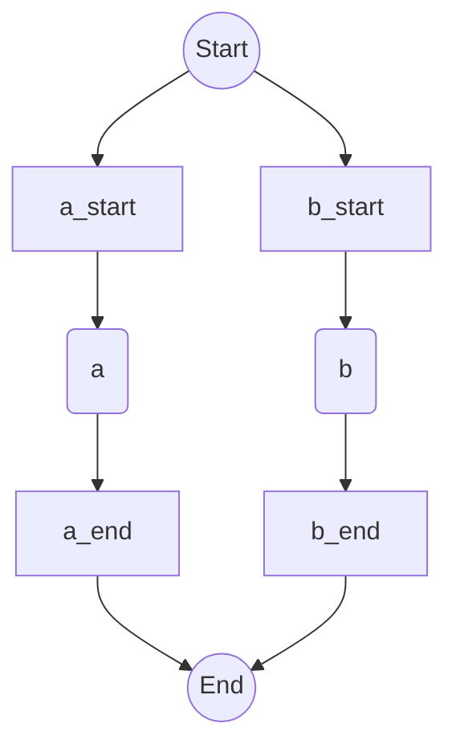

# Engineering the Rust Compiler
## A Comprehensive Guide from Foundations to Production-Grade Implementation

---

# Table of Contents

- [Preface](#preface)
- [How to Use This Guide](#how-to-use-this-guide)
- [Rust Standard Library Reference](#rust-standard-library-reference) [Basic]
- [Part 0: Rust Fundamentals for Compiler Development](#part-0-rust-fundamentals-for-compiler-development) [Basic]
    - [Chapter 1: Why Rust for Compilers?](#chapter-1-why-rust-for-compilers)
    - [Chapter 2: Core Rust Concepts](#chapter-2-core-rust-concepts)
    - [Chapter 2.4: Ownership in Depth](#chapter-24-ownership-in-depth)
    - [Chapter 2.5: Lifetimes in Compilers](#chapter-25-lifetimes-in-compilers)
    - [Chapter 2.6: Traits and the Visitor Pattern](#chapter-26-traits-and-the-visitor-pattern)
- [Part 1: Computer Science Foundations](#part-1-computer-science-foundations) [Basic]
    - [Chapter 3: Data Structures](#chapter-3-data-structures)
    - [Chapter 3.5: Graphs and Compilers](#chapter-35-graphs-and-compilers)
    - [Chapter 3.6: Big-O Notation and Performance](#chapter-36-big-o-notation-and-performance)
    - [Chapter 3.7: Formal Grammars and the Chomsky Hierarchy](#chapter-37-formal-grammars-and-the-chomsky-hierarchy) [Advanced]
- [Part 2: Compiler Pipeline Basics](#part-2-compiler-pipeline-basics) [Intermediate]
    - [Chapter 4: Lexical Analysis](#chapter-4-lexical-analysis)
    - [Chapter 4.3: Error Recovery in Lexers](#chapter-43-error-recovery-in-lexers)
    - [Chapter 4.4: Handling Whitespace and Comments](#chapter-44-handling-whitespace-and-comments)
    - [Chapter 4.5: DFA and NFA Construction](#chapter-45-dfa-and-nfa-construction) [Advanced]
    - [Chapter 5: Parsing](#chapter-5-parsing)
    - [Chapter 5.3: Operator Precedence and Associativity](#chapter-53-operator-precedence-and-associativity)
    - [Chapter 5.4: Pratt Parsing](#chapter-54-pratt-parsing)
    - [Chapter 5.5: Error Recovery in Parsers](#chapter-55-error-recovery-in-parsers)
    - [Chapter 5.6: The Abstract Syntax Tree (AST) Concept](#chapter-56-the-abstract-syntax-tree-ast-concept)
    - [Chapter 5.7: LR and LALR Parsing](#chapter-57-lr-and-lalr-parsing) [Advanced]
    - [Chapter 6: Semantic Analysis](#chapter-6-semantic-analysis)
    - [Chapter 6.3: Nested Scopes and Scope Stacks](#chapter-63-nested-scopes-and-scope-stacks)
    - [Chapter 6.4: Type Inference](#chapter-64-type-inference)
- [Part 3: Intermediate Representation](#part-3-intermediate-representation) [Advanced]
    - [Chapter 7: Intermediate Representation (IR) Generation](#chapter-7-intermediate-representation-ir-generation)
    - [Chapter 7.3: HIR, MIR, and LIR](#chapter-73-hir-mir-and-lir)
    - [Chapter 7.4: Static Single Assignment (SSA) Form](#chapter-74-static-single-assignment-ssa-form)
    - [Chapter 7.5: Control Flow Graphs (CFGs)](#chapter-75-control-flow-graphs-cfgs)
    - [Chapter 7.6: Dataflow Analysis](#chapter-76-dataflow-analysis) [Advanced]
    - [Chapter 7.7: SSA Construction (Dominance Frontiers)](#chapter-77-ssa-construction-dominance-frontiers) [Advanced]
- [Part 4: Professional Compiler Architecture](#part-4-professional-compiler-architecture) [Advanced]
    - [Chapter 8: Project Structure](#chapter-8-project-structure)
    - [Chapter 8.2: The Compilation Pipeline Data Flow](#chapter-82-the-compilation-pipeline-data-flow)
    - [Chapter 8.3: Implementing the Visitor Pattern](#chapter-83-implementing-the-visitor-pattern)
    - [Chapter 8.4: The Session Object](#chapter-84-the-session-object)
    - [Chapter 8.5: Runtime Systems and Memory Management](#chapter-85-runtime-systems-and-memory-management) [Advanced]
    - [Chapter 8.6: Just-In-Time (JIT) Compilation](#chapter-86-just-in-time-jit-compilation) [Advanced]
- [Part 5: Performance & Optimization](#part-5-performance--optimization) [Advanced]
    - [Chapter 9: Vectorization and SIMD](#chapter-9-vectorization-and-simd)
    - [Chapter 10: Using LLVM with Rust](#chapter-10-using-llvm-with-rust)
    - [Chapter 10.2: Common Optimization Passes](#chapter-102-common-optimization-passes)
    - [Chapter 10.2.1: Constant Folding](#chapter-1021-constant-folding) [Advanced]
    - [Chapter 10.2.2: Dead Code Elimination (DCE)](#chapter-1022-dead-code-elimination-dce) [Advanced]
    - [Chapter 10.2.3: Function Inlining](#chapter-1023-function-inlining) [Advanced]
    - [Chapter 10.2.4: Loop Unrolling](#chapter-1024-loop-unrolling) [Advanced]
    - [Chapter 10.2.5: Instruction Selection (Tree Tiling)](#chapter-1025-instruction-selection-tree-tiling) [Advanced]
    - [Chapter 10.2.6: Register Allocation (Graph Coloring)](#chapter-1026-register-allocation-graph-coloring) [Advanced]
    - [Chapter 10.2.7: Calling Conventions and ABI](#chapter-1027-calling-conventions-and-abi) [Advanced]
- [Part 6: Testing & Automation](#part-6-testing--automation) [Intermediate]
    - [Chapter 11: Performance Monitoring](#chapter-11-performance-monitoring)
    - [Chapter 12: Test Generation](#chapter-12-test-generation)
    - [Chapter 12.3: Snapshot Testing](#chapter-123-snapshot-testing)
    - [Chapter 12.4: Fuzzing Compilers](#chapter-124-fuzzing-compilers)
    - [Chapter 13: Build System Automation](#chapter-13-build-system-automation)
- [Part 7: Python Automation](#part-7-python-automation-for-compiler-development) [Intermediate]
- [Debugging & Troubleshooting](#debugging--troubleshooting-guide)
- [Appendices](#appendices)
    - [Appendix A: Glossary of Compiler Terms](#appendix-a-glossary-of-compiler-terms)
    - [Appendix B: Rust Compiler Error Codes Reference](#appendix-b-rust-compiler-error-codes-reference)
    - [Appendix C: Advanced Rust Types in Compilers](#appendix-c-advanced-rust-types-in-compilers)
    - [Appendix D: Further Reading and Resources](#appendix-d-further-reading-and-resources)
- [References](#references)

---

# Preface

Compiler engineering is one of the most intellectually rewarding and practically valuable skills in computer science. Yet most resources assume significant background knowledge, leaving beginners overwhelmed and professionals without practical guidance.

This guide bridges that gap. It takes you from zero computer science knowledge through advanced professional compiler engineering, combining rigorous theory with practical implementation in Rust and Python automation.

---

# How to Use This Guide

**For beginners:** Start from the Rust Standard Library Reference, then Part 0, and read sequentially.

**For experienced programmers:** Reference the Rust Standard Library Reference as needed, then start from Part 1.

**For professionals:** Use as a reference. The cheatsheet and appendices provide quick lookups.

---

# Rust Standard Library Reference [Basic]

This section explains every Rust function, method, and type used in this guide. Refer back here whenever you see unfamiliar syntax.

## Understanding Rust Types

### Option<T>: The Absence of Null [Basic]

**Conceptual Explanation:** In many programming languages, the concept of a value that might not exist is represented by `null` or `nil`. However, `null` has been famously called the "billion-dollar mistake" due to the countless runtime errors it causes when developers forget to check for its presence. Rust addresses this by using the `Option<T>` enum, a fundamental concept in functional programming and type theory known as an **Algebraic Data Type (ADT)**.

`Option<T>` is an enum with two variants:
*   `Some(T)`: Indicates that a value of type `T` is present.
*   `None`: Indicates that there is no value.

This design forces the programmer to explicitly handle both the presence and absence of a value at compile time, eliminating an entire class of runtime errors.

**Mental Model:** Think of `Option<T>` as a box. The box can either contain something (`Some(value)`) or be empty (`None`). You can't just reach into the box and assume there's something there; you *must* first check if it's empty or not. This explicit check is enforced by the type system, making your code safer and more robust.

**Visual Representation:**

```mermaid
graph TD
    A[Option<T>] --> B{Is there a value?}
    B -- Yes --> C[Some(value)]
    B -- No --> D[None]
```

**When to Use:** `Option<T>` is ideal for scenarios where a function might legitimately not return a value, or when querying a data structure (like a hash map) for an item that might not exist. In compiler development, this is common when looking up symbols in a symbol table, retrieving type information, or handling optional syntax elements.

**Example: Handling Optional Values**

```rust
// Think: Declare an Option that might hold an i32
let maybe_number: Option<i32> = Some(42);
// Think: Declare an Option that explicitly holds no value
let no_number: Option<i32> = None;

// Think: The `match` statement forces handling both Some and None cases
match maybe_number {
    // Think: If it's Some, bind the inner value to `n` and print it
    Some(n) => println!("Got: {}", n),
    // Think: If it's None, print a message indicating no value
    None => println!("No value"),
}

// Think: `if let` provides a concise way to handle only the Some case
if let Some(value) = no_number {
    // Think: This block only executes if no_number is Some
    println!("This will not print: {}", value);
} else {
    // Think: This block executes if no_number is None
    println!("No value was present in the if let check.");
}
```

**Key Methods for `Option<T>`:**

| Method | Description | Example | Compiler Relevance |
|--------|-------------|---------|--------------------|
| `is_some()` | Returns `true` if the option is `Some`. | `opt.is_some()` | Checking if a symbol lookup succeeded. |
| `is_none()` | Returns `true` if the option is `None`. | `opt.is_none()` | Verifying the absence of an optional attribute. |
| `unwrap()` | Returns the contained `Some` value, panicking if `self` is `None`. **Avoid in production code.** | `opt.unwrap()` | Only when you are absolutely certain a value exists (e.g., after prior checks). |
| `unwrap_or(default)` | Returns the contained `Some` value or a provided default. | `opt.unwrap_or(0)` | Providing a default type if a lookup fails. |
| `map(f)` | Maps an `Option<T>` to `Option<U>` by applying a function to the contained value if `Some`. | `opt.map(|x| x * 2)` | Transforming an AST node if it exists. |
| `and_then(f)` | Chains `Option` operations. If `Some`, applies `f` which returns another `Option`. | `opt.and_then(|x| Some(x * 2))` | Chaining multiple lookups that might fail. |
| `filter(f)` | Returns `Some` if the option is `Some` and the predicate `f` returns `true`, otherwise returns `None`. | `opt.filter(|x| x > 10)` | Filtering a list of optional attributes based on a condition. |
| `ok_or(err)` | Transforms the `Option<T>` into a `Result<T, E>`, mapping `Some(v)` to `Ok(v)` and `None` to `Err(err)`. | `opt.ok_or("error")` | Converting an optional lookup result into a fallible operation. |

**Real-World Compiler Example: Symbol Table Lookup**

```rust
use std::collections::HashMap;

// Think: Define a simple Type enum for demonstration
#[derive(Debug, PartialEq, Eq)]
enum Type { Integer, Boolean, String }

// Think: A HashMap represents our symbol table: variable name -> its type
let mut symbol_table: HashMap<String, Type> = HashMap::new();
// Think: Insert a variable 'x' with type Integer
symbol_table.insert("x".to_string(), Type::Integer);

// Think: Attempt to get the type of 'x'. `get` returns Option<&Type>.
match symbol_table.get("x") {
    // Think: If Some, we found the type, print it
    Some(ty) => println!("Variable x has type: {:?}", ty),
    // Think: If None, the variable is not defined, print an error
    None => println!("ERROR: Variable x not defined"),
}

// Think: Attempt to get the type of 'y', which doesn't exist
match symbol_table.get("y") {
    // Think: This case will not be hit
    Some(ty) => println!("Variable y has type: {:?}", ty),
    // Think: This case will be hit, indicating 'y' is undefined
    None => println!("ERROR: Variable y not defined"),
}

// Think: A more concise way to handle the Some case using `if let`
if let Some(ty) = symbol_table.get("x") {
    // Think: This block executes only if 'x' is found
    println!("Type of x (if let): {:?}", ty);
}
```

### Result<T, E>: Robust Error Handling [Basic]

**Conceptual Explanation:** Just as `Option<T>` handles the absence of a value, `Result<T, E>` is Rust's primary mechanism for handling **recoverable errors**. It is another fundamental Algebraic Data Type (ADT) that explicitly represents either success or failure. This forces callers to acknowledge and handle potential errors, leading to more robust and reliable code.

`Result<T, E>` is an enum with two variants:
*   `Ok(T)`: Indicates a successful operation, containing the successful value of type `T`.
*   `Err(E)`: Indicates a failed operation, containing an error value of type `E`.

By encoding success and failure directly into the type system, Rust ensures that error handling is not an afterthought but an integral part of the program's logic.

**Mental Model:** Think of `Result<T, E>` as a sealed envelope. When you open it, you either find a successful outcome (`Ok(value)`) or an error message (`Err(error)`). You can't ignore the possibility of an error; the type system makes you deal with both scenarios. This is far safer than relying on exceptions, which can be thrown from anywhere and are often caught much later, or `errno` flags, which are easy to forget to check.

**Visual Representation:**

```mermaid
graph TD
    A[Result<T, E>] --> B{Operation Successful?}
    B -- Yes --> C[Ok(value)]
    B -- No --> D[Err(error)]
```

**When to Use:** `Result<T, E>` is essential for any operation that might fail due to external factors (file I/O, network requests) or logical conditions (parsing invalid input, type mismatches). In compilers, this includes lexical analysis (invalid characters), parsing (syntax errors), semantic analysis (type errors, undefined variables), and code generation (unsupported features).

**Example: Parsing a Number (Fallible Operation)**

```rust
// Think: Define a function that attempts to parse a string into an i32.
// Think: It returns a Result, where Ok contains the i32, and Err contains a String error message.
fn parse_number(s: &str) -> Result<i32, String> {
    // Think: s.parse::<i32>() returns a Result<i32, ParseIntError>.
    // Think: We use .map_err() to convert the specific ParseIntError into our generic String error.
    s.parse::<i32>()
        .map_err(|_| format!("Error: \'{}\' is not a valid number", s))
}

// Think: Demonstrate using the parse_number function.
// Think: Call with valid input.
match parse_number("42") {
    // Think: If successful (Ok), print the parsed number.
    Ok(n) => println!("Successfully parsed: {}", n),
    // Think: If failed (Err), print the error message.
    Err(e) => println!("Failed to parse: {}", e),
}

// Think: Call with invalid input.
match parse_number("hello") {
    // Think: This case will not be hit.
    Ok(n) => println!("Successfully parsed: {}", n),
    // Think: This case will be hit, showing the error.
    Err(e) => println!("Failed to parse: {}", e),
}
```

**Key Methods for `Result<T, E>`:**

| Method | Description | Example | Compiler Relevance |
|--------|-------------|---------|--------------------|
| `is_ok()` | Returns `true` if the result is `Ok`. | `res.is_ok()` | Checking if a compilation step succeeded before proceeding. |
| `is_err()` | Returns `true` if the result is `Err`. | `res.is_err()` | Detecting if an error occurred during parsing. |
| `unwrap()` | Returns the contained `Ok` value, panicking if `self` is `Err`. **Avoid in production code.** | `res.unwrap()` | Only when you are absolutely certain an operation will succeed (e.g., in tests). |
| `unwrap_or(default)` | Returns the contained `Ok` value or a provided default. | `res.unwrap_or(0)` | Providing a default value if a computation fails (use with caution). |
| `map(f)` | Maps a `Result<T, E>` to `Result<U, E>` by applying a function to the contained `Ok` value. | `res.map(|x| x * 2)` | Transforming a successful parsing result. |
| `map_err(f)` | Maps a `Result<T, E>` to `Result<T, F>` by applying a function to the contained `Err` value. | `res.map_err(|e| e.to_string())` | Converting internal error types to a user-friendly format. |
| `and_then(f)` | Chains `Result` operations. If `Ok`, applies `f` which returns another `Result`. | `res.and_then(|x| Ok(x * 2))` | Chaining multiple fallible compilation steps (e.g., lexing then parsing). |
| `?` operator | A concise way to propagate errors. If `Err`, it returns the error from the current function. If `Ok`, it unwraps the value. | `let x = parse_number(s)?;` | The idiomatic way to handle errors in a sequence of operations. |

**The `?` Operator: Streamlining Error Propagation**

The `?` operator is syntactic sugar for a `match` expression that either returns the `Err` variant early or unwraps the `Ok` variant. It significantly cleans up code that involves multiple fallible operations.

```rust
// Think: Function that parses two numbers and adds them, returning a Result.
fn parse_and_add(s1: &str, s2: &str) -> Result<i32, String> {
    // Think: Use `?` to handle the first parsing operation.
    // Think: If parse_number(s1) returns Err, this function immediately returns that Err.
    // Think: If Ok, `n1` gets the unwrapped i32 value.
    let n1 = parse_number(s1)?;
    
    // Think: Use `?` to handle the second parsing operation.
    // Think: If parse_number(s2) returns Err, this function immediately returns that Err.
    // Think: If Ok, `n2` gets the unwrapped i32 value.
    let n2 = parse_number(s2)?;
    
    // Think: If both parsing operations succeed, perform the addition and return Ok.
    Ok(n1 + n2)
}

// Think: Test with valid input.
match parse_and_add("10", "20") {
    Ok(sum) => println!("Sum: {}", sum),
    Err(e) => println!("Error: {}", e),
}

// Think: Test with invalid input for the first number.
match parse_and_add("abc", "20") {
    Ok(sum) => println!("Sum: {}", sum),
    Err(e) => println!("Error: {}", e),
}

// Think: Test with invalid input for the second number.
match parse_and_add("10", "xyz") {
    Ok(sum) => println!("Sum: {}", sum),
    Err(e) => println!("Error: {}", e),
}
```

**Real-World Compiler Example: Type Checking an Expression**

```rust
use std::collections::HashMap;

// Think: Define a simple Type enum for demonstration
#[derive(Debug, PartialEq, Eq, Clone)]
enum Type { Integer, Boolean, String }

// Think: Define a simplified Expression enum for our AST nodes
#[derive(Debug)]
enum Expr {
    Number(i32),
    Identifier(String),
    BinaryOp { left: Box<Expr>, op: String, right: Box<Expr> },
}

// Think: A simplified context for type checking, including a symbol table
struct TypeChecker {
    symbol_table: HashMap<String, Type>,
}

impl TypeChecker {
    // Think: Constructor for our TypeChecker
    fn new() -> Self {
        let mut symbol_table = HashMap::new();
        // Think: Pre-populate with some known variables
        symbol_table.insert("x".to_string(), Type::Integer);
        symbol_table.insert("flag".to_string(), Type::Boolean);
        TypeChecker { symbol_table }
    }

    // Think: Helper to look up a variable type, returning Option<Type>
    fn lookup_variable(&self, name: &str) -> Option<Type> {
        self.symbol_table.get(name).cloned()
    }

    // Think: The core type checking function, which can fail and returns a Result.
    fn check_type(&self, expr: &Expr) -> Result<Type, String> {
        match expr {
            // Think: A number literal always has Integer type.
            Expr::Number(_) => Ok(Type::Integer),
            // Think: For an identifier, look it up in the symbol table.
            Expr::Identifier(id) => {
                // Think: Convert the Option<Type> from lookup_variable into a Result.
                // Think: If lookup_variable returns None, create an Err with a formatted message.
                self.lookup_variable(id)
                    .ok_or_else(|| format!("Semantic Error: Undefined variable \'{}\'", id))
            }
            // Think: For a binary operation, recursively check types of left and right operands.
            Expr::BinaryOp { left, op, right } => {
                // Think: Use `?` to propagate errors from checking the left operand.
                let left_type = self.check_type(left)?;
                // Think: Use `?` to propagate errors from checking the right operand.
                let right_type = self.check_type(right)?;
                
                // Think: Perform type compatibility checks based on the operator.
                if op == "+" || op == "-" || op == "*" || op == "/" {
                    // Think: For arithmetic ops, both operands must be Integer.
                    if left_type != Type::Integer || right_type != Type::Integer {
                        return Err(format!("Type Error: Operator \'{}\' expects integers, got {:?} and {:?}", op, left_type, right_type));
                    }
                    // Think: Result of arithmetic op is Integer.
                    Ok(Type::Integer)
                } else if op == "==" || op == "!=" {
                    // Think: For comparison ops, operands must be compatible.
                    if left_type != right_type {
                        return Err(format!("Type Error: Operator \'{}\' expects compatible types, got {:?} and {:?}", op, left_type, right_type));
                    }
                    // Think: Result of comparison op is Boolean.
                    Ok(Type::Boolean)
                } else {
                    // Think: Handle unknown operators.
                    Err(format!("Semantic Error: Unknown operator \'{}\'", op))
                }
            }
        }
    }
}

// Think: Create a type checker instance.
let type_checker = TypeChecker::new();

// Think: Example 1: Valid expression `x + 5`
let expr1 = Expr::BinaryOp {
    left: Box::new(Expr::Identifier("x".to_string())),
    op: "+".to_string(),
    right: Box::new(Expr::Number(5)),
};
match type_checker.check_type(&expr1) {
    Ok(ty) => println!("Expression 1 type: {:?}", ty),
    Err(e) => println!("Error checking Expression 1: {}", e),
}

// Think: Example 2: Invalid expression `y * 10` (undefined variable `y`)
let expr2 = Expr::BinaryOp {
    left: Box::new(Expr::Identifier("y".to_string())),
    op: "*".to_string(),
    right: Box::new(Expr::Number(10)),
};
match type_checker.check_type(&expr2) {
    Ok(ty) => println!("Expression 2 type: {:?}", ty),
    Err(e) => println!("Error checking Expression 2: {}", e),
}

// Think: Example 3: Type mismatch `flag + 1`
let expr3 = Expr::BinaryOp {
    left: Box::new(Expr::Identifier("flag".to_string())),
    op: "+".to_string(),
    right: Box::new(Expr::Number(1)),
};
match type_checker.check_type(&expr3) {
    Ok(ty) => println!("Expression 3 type: {:?}", ty),
    Err(e) => println!("Error checking Expression 3: {}", e),
}
```

## Understanding Collections

### Vec<T>: Dynamic, Contiguous Collections [Basic]

**Conceptual Explanation:** `Vec<T>` (short for "vector") is Rust's standard library type for a growable, heap-allocated array. It stores a contiguous sequence of elements of type `T` and can dynamically increase or decrease in size. This makes it a versatile data structure for collecting items when the exact number of items is not known at compile time.

**Mental Model:** Imagine a row of numbered mailboxes (memory addresses) that can expand or shrink as needed. When you add a new letter (element), if there's no space, the entire row of mailboxes might be moved to a larger location to accommodate more. When you remove a letter, the remaining ones might shift to fill the gap. `Vec<T>` provides efficient access to elements by index, similar to a traditional array, but with the flexibility of dynamic resizing.

**Visual Representation:**

```mermaid
graph LR
    subgraph Heap Memory
        A[Vec<T> Data] -- 0 --> B(Element 0)
        A -- 1 --> C(Element 1)
        A -- 2 --> D(Element 2)
        A -- ... --> E(...)
    end
    F[Vec<T> (Stack)] -- Pointer, Capacity, Length --> A
```

**When to Use:** `Vec<T>` is a workhorse in compiler development. It's used to store sequences of tokens generated by the lexer, lists of statements in an Abstract Syntax Tree (AST), collections of intermediate representation (IR) instructions, or any other scenario where you need an ordered, mutable list of items.

**Example: Managing Tokens in a Lexer**

```rust
// Think: Define a simple Token enum for demonstration
#[derive(Debug, PartialEq, Eq, Clone)]
enum Token {
    Keyword(String),
    Identifier(String),
    Number(i32),
    Operator(char),
    Eof,
    Error(String),
}

// Think: Create a new, empty vector to hold our tokens.
let mut tokens: Vec<Token> = Vec::new();

// Think: Simulate a lexer adding tokens to the vector.
// Think: Add a keyword token.
tokens.push(Token::Keyword("let".to_string()));
// Think: Add an identifier token.
tokens.push(Token::Identifier("my_var".to_string()));
// Think: Add an operator token.
tokens.push(Token::Operator("="));
// Think: Add a number token.
tokens.push(Token::Number(123));
// Think: Add an end-of-file token.
tokens.push(Token::Eof);

println!("Current tokens: {:?}", tokens);

// Think: Accessing elements by index (can panic if out of bounds).
// Think: Get the first token.
let first_token = &tokens[0];
println!("First token: {:?}", first_token);

// Think: Safely access elements using `get()`, which returns an Option.
// Think: Attempt to get the second token.
if let Some(second_token) = tokens.get(1) {
    println!("Second token (safe access): {:?}", second_token);
}

// Think: Attempt to get a token at an invalid index.
if let None = tokens.get(10) {
    println!("Attempted to access out-of-bounds index, got None.");
}

// Think: Remove the last token (Eof) using `pop()`.
let last_token = tokens.pop();
println!("Popped token: {:?}", last_token);
println!("Tokens after pop: {:?}", tokens);

// Think: Insert a new token at a specific position.
// Think: Insert an operator token at index 2.
tokens.insert(2, Token::Operator("+"));
println!("Tokens after insert: {:?}", tokens);

// Think: Iterate over tokens.
println!("Iterating through tokens:");
for (i, token) in tokens.iter().enumerate() {
    println!("  Token {}: {:?}", i, token);
}
```

**Key Methods for `Vec<T>`:**

| Method | Description | Example | Compiler Relevance |
|--------|-------------|---------|--------------------|
| `Vec::new()` | Creates an empty `Vec<T>`. | `let mut v = Vec::new();` | Initializing a list of tokens or AST nodes. |
| `vec![...]` | Creates a `Vec<T>` with initial elements. | `let v = vec![1, 2, 3];` | Defining a fixed set of keywords. |
| `push(value)` | Appends an element to the end. | `v.push(Token::Eof);` | Adding tokens from the lexer output. |
| `pop()` | Removes and returns the last element as `Option<T>`. | `v.pop()` | Consuming tokens from the end of a buffer. |
| `len()` | Returns the number of elements. | `tokens.len()` | Checking the size of a token stream or statement list. |
| `is_empty()` | Returns `true` if the vector contains no elements. | `tokens.is_empty()` | Checking if there are more tokens to process. |
| `get(index)` | Returns a reference to the element at `index` as `Option<&T>`. | `tokens.get(0)` | Safely peeking at the next token without consuming it. |
| `[index]` | Direct indexing (can panic). | `tokens[0]` | Accessing elements when bounds are guaranteed (e.g., after `len()` check). |
| `iter()` | Returns an iterator over the elements. | `for t in v.iter() { }` | Traversing AST nodes for analysis. |
| `iter_mut()` | Returns a mutable iterator over the elements. | `for t in v.iter_mut() { }` | Modifying IR instructions during optimization passes. |
| `insert(idx, val)` | Inserts an element at `idx`, shifting subsequent elements. | `v.insert(1, Token::Op);` | Inserting new instructions during code generation. |
| `remove(idx)` | Removes the element at `idx`, shifting subsequent elements. | `v.remove(0);` | Removing dead code or redundant instructions. |
| `extend(iter)` | Appends all elements from an iterator. | `v.extend(other_vec);` | Merging lists of tokens or IR blocks. |


### HashMap<K, V>: Efficient Key-Value Storage [Basic]

**Conceptual Explanation:** `HashMap<K, V>` is Rust's implementation of a hash table, providing efficient storage and retrieval of key-value pairs. It maps keys of type `K` to values of type `V`. The core idea behind a hash map is to use a **hash function** to compute an index into an array of buckets, where the key-value pairs are stored. This allows for average-case O(1) (constant time) complexity for insertion, deletion, and lookup operations, making it incredibly fast for scenarios requiring quick data access.

**Mental Model:** Imagine a library where each book (value) has a unique catalog number (key). Instead of searching every shelf, you go to a special index (the hash function) that tells you exactly which section (bucket) the book is in. Even if a few books are in the same section, finding the one you need is much faster than searching the entire library. This system is designed for speed when you know what you're looking for by its unique identifier.

**Visual Representation:**

```mermaid
graph TD
    A[Key] --> B{Hash Function}
    B --> C[Hash Value]
    C --> D[Bucket Index]
    D --> E[Bucket (LinkedList/Vec)]
    E -- Contains --> F[Key-Value Pair]
```

**When to Use:** `HashMap<K, V>` is indispensable in compiler construction, primarily for implementing **symbol tables**. A symbol table stores information about identifiers (variable names, function names, types) encountered in the source code, mapping each identifier (key) to its associated metadata (value), such as its type, scope, or memory location. It's also useful for storing metadata about AST nodes or IR instructions.

**Example: Implementing a Symbol Table**

```rust
use std::collections::HashMap;

// Think: Define a simple Type enum for demonstration
#[derive(Debug, PartialEq, Eq, Clone)]
enum Type { Integer, Boolean, String, Function { params: Vec<Type>, return_type: Box<Type> } }

// Think: Create a new, mutable HashMap to serve as our symbol table.
// Think: Keys are String (variable/function names), values are Type.
let mut symbol_table: HashMap<String, Type> = HashMap::new();

// Think: Insert a variable declaration into the symbol table.
symbol_table.insert("x".to_string(), Type::Integer);
// Think: Insert another variable.
symbol_table.insert("name".to_string(), Type::String);
// Think: Insert a function declaration.
symbol_table.insert("add".to_string(), Type::Function {
    params: vec![Type::Integer, Type::Integer],
    return_type: Box::new(Type::Integer),
});

println!("Symbol Table: {:?}", symbol_table);

// Think: Look up the type of variable "x". `get()` returns Option<&Type>.
match symbol_table.get("x") {
    // Think: If Some, the variable was found, print its type.
    Some(ty) => println!("Type of 'x': {:?}", ty),
    // Think: If None, the variable is not defined.
    None => println!("ERROR: Variable 'x' not defined in symbol table."),
}

// Think: Look up a non-existent variable "y".
match symbol_table.get("y") {
    Some(ty) => println!("Type of 'y': {:?}", ty),
    None => println!("ERROR: Variable 'y' not defined in symbol table."),
}

// Think: Check if a key exists without retrieving its value.
if symbol_table.contains_key("add") {
    println!("Function 'add' is defined.");
}

// Think: Iterate over all key-value pairs in the symbol table.
println!("\nAll symbols:");
for (name, ty) in &symbol_table {
    println!("  {}: {:?}", name, ty);
}

// Think: Update the type of an existing variable.
symbol_table.insert("x".to_string(), Type::Boolean);
println!("\nSymbol Table after updating 'x': {:?}", symbol_table);
```

**Key Methods for `HashMap<K, V>`:**

| Method | Description | Example | Compiler Relevance |
|--------|-------------|---------|--------------------|
| `HashMap::new()` | Creates an empty `HashMap`. | `let mut map = HashMap::new();` | Initializing a new scope's symbol table. |
| `insert(key, value)` | Inserts a key-value pair. If the key exists, its value is updated. | `map.insert("var", Type::Int);` | Adding new declarations to the symbol table. |
| `get(key)` | Returns an `Option<&V>` reference to the value associated with `key`. | `map.get("var")` | Looking up the type or other metadata of an identifier. |
| `remove(key)` | Removes a key-value pair and returns `Option<V>` of the removed value. | `map.remove("temp");` | Removing temporary variables or symbols from a scope. |
| `contains_key(key)` | Returns `true` if the map contains a value for the specified key. | `map.contains_key("func")` | Checking if an identifier has already been declared. |
| `len()` | Returns the number of key-value pairs. | `map.len()` | Getting the count of declared symbols in a scope. |
| `is_empty()` | Returns `true` if the map contains no elements. | `map.is_empty()` | Checking if a symbol table is empty. |
| `keys()` | Returns an iterator over the keys. | `for k in map.keys() { }` | Listing all declared identifiers. |
| `values()` | Returns an iterator over the values. | `for v in map.values() { }` | Inspecting all types or attributes. |
| `iter()` | Returns an iterator over `(&K, &V)` pairs. | `for (k, v) in map.iter() { }` | Traversing the symbol table for various analyses. |
| `entry(key)` | Provides a convenient way to conditionally insert or modify a value. | `map.entry("x").or_insert(Type::Int);` | Ensuring a symbol exists or inserting a default if not. |


## Understanding Iterators

### Iterator Methods: map(), filter(), fold()

**What iterators are:** A way to process collections without writing explicit loops.

**Why they matter:** Cleaner code, often better optimized by the compiler.

#### map(): Transform Each Element

**What it does:** Apply a function to each element, creating a new collection.

**Syntax:** `collection.iter().map(|element| transformation).collect()`

**Example:**

```rust
let numbers = vec![1, 2, 3, 4];

// Double each number
let doubled: Vec<i32> = numbers
    .iter()           // Create iterator
    .map(|x| x * 2)   // Transform each element
    .collect();       // Collect into Vec

// doubled = [2, 4, 6, 8]
```

**Real example from compilers:**

```rust
// Convert tokens to their string representations
let tokens = vec![Token::Let, Token::Number(42)];

let token_strings: Vec<String> = tokens
    .iter()
    .map(|t| format!("{:?}", t))
    .collect();

// token_strings = ["Let", "Number(42)"]
```

#### filter(): Keep Matching Elements

**What it does:** Keep only elements that match a condition.

**Syntax:** `collection.iter().filter(|element| condition).collect()`

**Example:**

```rust
let numbers = vec![1, 2, 3, 4, 5, 6];

// Keep only even numbers
let evens: Vec<i32> = numbers
    .iter()
    .filter(|x| x % 2 == 0)  // Keep if condition is true
    .collect();

// evens = [2, 4, 6]
```

**Real example from compilers:**

```rust
// Keep only error tokens
let tokens = vec![Token::Number(1), Token::Error("bad"), Token::Number(2)];

let errors: Vec<_> = tokens
    .iter()
    .filter(|t| matches!(t, Token::Error(_)))
    .collect();
```

#### fold(): Combine Into One Value

**What it does:** Combine all elements into a single value.

**Syntax:** `collection.iter().fold(initial_value, |accumulator, element| new_accumulator)`

**Example:**

```rust
let numbers = vec![1, 2, 3, 4];

// Sum all numbers
let sum = numbers
    .iter()
    .fold(0, |acc, x| acc + x);

// sum = 10
```

**Step by step:**
```
Start: acc = 0
Step 1: acc = 0 + 1 = 1
Step 2: acc = 1 + 2 = 3
Step 3: acc = 3 + 3 = 6
Step 4: acc = 6 + 4 = 10
Result: 10
```

**Real example from compilers:**

```rust
// Count total tokens
let tokens = vec![Token::Let, Token::Number(42), Token::Semicolon];

let count = tokens
    .iter()
    .fold(0, |acc, _| acc + 1);

// count = 3
```

#### Chaining Iterators

**What it is:** Combining multiple operations.

**Example:**

```rust
let numbers = vec![1, 2, 3, 4, 5, 6];

// Get even numbers, double them, sum them
let result = numbers
    .iter()
    .filter(|x| x % 2 == 0)      // [2, 4, 6]
    .map(|x| x * 2)              // [4, 8, 12]
    .fold(0, |acc, x| acc + x);  // 24

// result = 24
```

**Real example from compilers:**

```rust
// Get all identifiers, convert to uppercase, collect
let tokens = vec![
    Token::Identifier("x".to_string()),
    Token::Number(42),
    Token::Identifier("y".to_string()),
];

let identifiers: Vec<String> = tokens
    .iter()
    .filter_map(|t| match t {
        Token::Identifier(id) => Some(id.to_uppercase()),
        _ => None,
    })
    .collect();

// identifiers = ["X", "Y"]
```

## Understanding String Methods

### String Operations

**String vs &str:**

```rust
let owned = String::from("hello");     // Owned String
let borrowed: &str = &owned;           // Borrowed reference
let literal = "hello";                 // &str literal
```

**Key methods:**

| Method | What it does | Example |
|--------|-------------|---------|
| `push_str(s)` | Add string to end | `s.push_str(" world");` |
| `push(c)` | Add character to end | `s.push('!');` |
| `len()` | Length in bytes | `s.len()` → 5 |
| `chars()` | Iterate characters | `for c in s.chars() { }` |
| `as_bytes()` | Get bytes | `s.as_bytes()[0]` |
| `to_string()` | Convert to String | `"hello".to_string()` |
| `to_uppercase()` | Convert to uppercase | `s.to_uppercase()` |
| `to_lowercase()` | Convert to lowercase | `s.to_lowercase()` |
| `trim()` | Remove whitespace | `s.trim()` |
| `split(sep)` | Split by separator | `s.split(' ')` |
| `contains(s)` | Does it contain? | `s.contains("ell")` → true |
| `starts_with(s)` | Starts with? | `s.starts_with("he")` → true |
| `ends_with(s)` | Ends with? | `s.ends_with("lo")` → true |

**Real example from compilers:**

```rust
// Reading identifier characters
let input = "hello_world123";
let mut id = String::new();

for ch in input.chars() {
    if ch.is_alphanumeric() || ch == '_' {
        id.push(ch);
    } else {
        break;
    }
}

// id = "hello_world123"
```

## Understanding match and if let

### match: Handle All Cases

**What it is:** Pattern matching. Handle different cases explicitly.

**Why it matters:** Compiler forces you to handle all cases.

**Syntax:**

```rust
match value {
    pattern1 => action1,
    pattern2 => action2,
    _ => default_action,  // _ matches anything
}
```

**Example:**

```rust
enum Token {
    Number(i32),
    Identifier(String),
    Operator(char),
}

let token = Token::Number(42);

match token {
    Token::Number(n) => println!("Number: {}", n),
    Token::Identifier(id) => println!("Identifier: {}", id),
    Token::Operator(op) => println!("Operator: {}", op),
}
```

### if let: Handle One Case

**What it is:** Simpler syntax when you only care about one case.

**Why it matters:** Less verbose than match when you don't need all cases.

**Syntax:**

```rust
if let pattern = value {
    // Handle this case
} else {
    // Handle other cases
}
```

**Example:**

```rust
let maybe_number: Option<i32> = Some(42);

// Instead of:
match maybe_number {
    Some(n) => println!("Got: {}", n),
    None => {},
}

// Use if let:
if let Some(n) = maybe_number {
    println!("Got: {}", n);
}
```

## Understanding Closures

**What they are:** Anonymous functions you can pass around.

**Syntax:** `|parameters| expression`

**Example:**

```rust
// Simple closure
let add_one = |x| x + 1;
println!("{}", add_one(5));  // 6

// Closure with multiple parameters
let add = |x, y| x + y;
println!("{}", add(2, 3));  // 5

// Closure with block
let greet = |name| {
    println!("Hello, {}!", name);
    name.len()
};
```

**Real example from compilers:**

```rust
// Using closure with map
let numbers = vec![1, 2, 3];
let doubled = numbers.iter().map(|x| x * 2).collect();

// Using closure with filter
let evens = numbers.iter().filter(|x| x % 2 == 0).collect();
```

---

# Part 0: Rust Fundamentals for Compiler Development [Basic]

## Chapter 1: Why Rust for Compilers?

Rust combines three critical properties essential for compiler development:

1. **Performance**: As fast as C. No garbage collection overhead.
2. **Memory Safety**: No segmentation faults or use-after-free bugs. Caught at compile time.
3. **Concurrency Safety**: No data races. Prevents entire classes of bugs.

## Chapter 2: Core Rust Concepts

### 2.1 Variables and Mutability

**What it is:** A variable is named storage. By default, variables are immutable.

**What to know:**

```rust
let x = 5;              // Immutable - can't change
// x = 10;             // ERROR!

let mut y = 5;          // Mutable - can change
y = 10;                 // OK
```

**When to use:** Always start immutable. Add `mut` only when needed.

### 2.2 Ownership

**What it is:** Every value has exactly one owner. When the owner goes out of scope, the value is dropped.

**What to know:**

```rust
let s = String::from("hello");      // s owns the String
let s2 = s;                         // Ownership moves to s2
// println!("{}", s);               // ERROR! s no longer owns it

let x = 5;                          // x owns the integer
let y = x;                          // x is still valid! (copied)
println!("{}", x);                  // OK
```

### 2.3 Borrowing

**What it is:** Temporary access without taking ownership. Use `&` for immutable, `&mut` for mutable.

**What to know:**

```rust
let s = String::from("hello");
let s1 = &s;                        // Immutable borrow
let s2 = &s;                        // Multiple immutable borrows OK
println!("{}", s1);                 // OK

let mut s = String::from("hello");
let s_mut = &mut s;                 // Mutable borrow
s_mut.push_str("!");
// println!("{}", s);               // ERROR!
```

**Golden rule:** Either multiple readers OR one writer, never both.

### 2.4 Ownership in Depth [Basic]

**Conceptual Explanation:** Ownership is Rust's unique way of managing memory without a garbage collector. It works through a set of rules that the compiler checks at compile time. The core idea is that every value in Rust has a single variable that is its "owner." When the owner's scope ends, Rust automatically cleans up the memory. This prevents memory leaks and "use-after-free" bugs, where a program tries to use memory that has already been released.

**Mental Model:** Imagine a library book. There is only one person who has the book checked out (the owner). If they give the book to someone else (a move), they no longer have it. If they let someone look at the book while they still have it (a borrow), they are still the owner. When the owner returns the book to the library (goes out of scope), the book is gone from their possession. This ensures the book is always accounted for and never lost or duplicated.

**Compilers and Ownership:** Compilers deal with massive, interconnected data structures like ASTs and Symbol Tables. Ownership ensures that these structures are cleanly managed. For example, when a function that generates an AST finishes, the ownership of that AST is passed back to the caller, ensuring the memory stays valid as long as needed.

**Common Borrow Checker Error:**

```rust
fn main() {
    let mut list = vec![1, 2, 3];
    let first = &list[0]; // Think: "Immutable borrow of list"
    
    list.push(4); // Think: "Mutable borrow of list occurs here"
    
    // println!("{}", first); // ERROR: cannot borrow `list` as mutable because it is also borrowed as immutable
}
```

**The Fix:** Ensure the immutable borrow (`first`) is no longer needed before performing the mutable operation (`push`), or clone the value if you need it independently.

### 2.5 Lifetimes in Compilers [Basic]

**Conceptual Explanation:** Lifetimes are a way for the Rust compiler to ensure that references are always valid. A lifetime is the period of time during which a reference points to a valid piece of memory. Most of the time, Rust infers lifetimes automatically, but sometimes you need to explicitly label them, especially when storing references inside structs.

**Mental Model:** Think of a lifetime as a "validity tag" on a reference. If you have a reference to a name in a book, that reference is only valid as long as the book exists. If the book is destroyed, the reference becomes a "dangling pointer." Lifetimes prevent this by ensuring the "book" (the data) lives at least as long as any "references" to it.

**Example: Storing References in a Token Struct**

```rust
// Think: "'a is a lifetime parameter"
// Think: "It says: 'This Token cannot outlive the source string it references'"
struct Token<'a> {
    kind: TokenKind,
    lexeme: &'a str, // Think: "A reference to a part of the source code"
}

fn main() {
    let source = String::from("let x = 5;");
    let token = Token {
        kind: TokenKind::Let,
        lexeme: &source[0..3], // Think: "Borrowing from source"
    };
    // If 'source' was dropped here, 'token' would be invalid.
    // Rust prevents this using lifetimes.
}
```

### 2.6 Traits and the Visitor Pattern [Basic]

**Conceptual Explanation:** Traits in Rust define shared behavior that different types can implement. They are similar to interfaces in other languages. In compiler development, the **Visitor Pattern** is a common design pattern used to traverse and perform operations on complex structures like an Abstract Syntax Tree (AST). Instead of putting all the logic (like type checking, optimization, code generation) inside the AST nodes themselves, you define a `Visitor` trait.

**Mental Model:** Imagine a building (the AST) with many different rooms (the nodes). A "Visitor" is a specialist (like an electrician, a plumber, or a painter) who walks through every room. Each specialist does something different in each room, but they all follow the same path through the building. The building doesn't need to know how to fix pipes or wires; it just needs to allow the specialist to enter.

**Practical Example: AST Visitor**

```rust
// Think: "Define the shared behavior for all visitors"
trait Visitor {
    fn visit_number(&mut self, n: i32);
    fn visit_binary_op(&mut self, left: &Expr, op: BinOp, right: &Expr);
}

// Think: "A specific visitor that prints the AST"
struct AstPrinter;

impl Visitor for AstPrinter {
    fn visit_number(&mut self, n: i32) {
        println!("Number: {}", n);
    }
    
    fn visit_binary_op(&mut self, left: &Expr, op: BinOp, right: &Expr) {
        println!("Op: {:?}", op);
        // Think: "Continue visiting children"
        left.accept(self);
        right.accept(self);
    }
}

// Think: "AST nodes must 'accept' a visitor"
impl Expr {
    fn accept(&self, visitor: &mut dyn Visitor) {
        match self {
            Expr::Number(n) => visitor.visit_number(*n),
            Expr::BinaryOp { left, op, right } => visitor.visit_binary_op(left, *op, right),
        }
    }
}
```

---

# Part 1: Computer Science Foundations [Basic]

## Chapter 3: Data Structures

### 3.1 Arrays and Vectors

**What it is:** Ordered collection of elements stored contiguously.

**Performance:**

| Operation | Time |
|-----------|------|
| Access by index | O(1) |
| Append | O(1) amortized |
| Insert at position | O(n) |

### 3.2 Stacks

**Mental model:** Last-In-First-Out (LIFO).

### 3.3 Trees

**Mental model:** Hierarchical structure.

### 3.4 Hash Tables

**Mental model:** Key-value storage with fast lookups.

### 3.5 Graphs and Compilers [Basic]

**Conceptual Explanation:** A graph is a collection of "nodes" connected by "edges." Unlike trees, graphs can have cycles (loops) and multiple paths between nodes. In compilers, graphs are everywhere. They represent the flow of a program, the dependencies between variables, and the relationships between different modules.

**Mental Model:** Think of a graph as a map of a city. The intersections are nodes, and the streets are edges. Some streets are one-way (directed graph), and you can travel in circles around blocks (cycles). A compiler uses this "map" to understand how data travels through your code and which parts of the code depend on others.

**Key Compiler Graphs:**
1.  **Control Flow Graph (CFG):** Represents all paths that might be traversed through a program during its execution. Nodes are "basic blocks" (sequences of instructions with no jumps), and edges represent jumps or falls-through.
2.  **Dependency Graph:** Shows which variables or modules depend on others. This is used to determine the order of compilation or which parts of the code can be optimized away.

### 3.6 Big-O Notation and Performance [Basic]

**Conceptual Explanation:** Big-O notation is a mathematical way to describe how the performance of an algorithm changes as the size of the input grows. It focuses on the "worst-case scenario." In compiler engineering, choosing the right algorithm can mean the difference between a compiler that takes seconds to run and one that takes hours.

**Mental Model:** Imagine you are looking for a name in a phone book. If you look page by page, it takes longer as the book gets bigger (O(n)). If you open the book in the middle and keep halving the search area, it's much faster even for huge books (O(log n)). Big-O is like a "speed limit" or "efficiency rating" for your code.

**Common Complexities in Compilers:**

| Notation | Name | Meaning in Compilers | Example |
|----------|------|----------------------|---------|
| **O(1)** | Constant | Time stays the same regardless of input size. | Accessing an element in a vector by index. |
| **O(log n)** | Logarithmic | Time grows slowly as input size increases. | Searching for a symbol in a balanced binary tree. |
| **O(n)** | Linear | Time grows proportionally to input size. | A single pass over the source code (Lexing). |
| **O(n log n)** | Linearithmic | Very efficient for large inputs. | Sorting tokens or identifiers. |
| **O(n^2)** | Quadratic | Time grows quickly; becomes slow for large inputs. | Naive nested loops for name resolution. |
| **O(2^n)** | Exponential | Becomes unusable very quickly. | Certain complex optimization or constraint solving problems. |

---

# Part 2: Compiler Pipeline Basics [Intermediate]

## Chapter 4: Lexical Analysis

### 4.1 What is Lexical Analysis?

**Conceptual Explanation:** Lexical analysis, or **lexing**, is the first phase of a compiler. Its primary job is to read the raw source code character by character and group them into meaningful units called **tokens**. Think of it like breaking down a sentence into individual words and punctuation marks.

**Mental Model:** Imagine a diligent librarian meticulously scanning a book. Instead of understanding the story, the librarian's job is to identify each word, number, and symbol, categorize it (e.g., "noun," "verb," "number"), and note its position.

### 4.2 Building a Lexer

**Token definition:**

```rust
#[derive(Debug, Clone, PartialEq)]
pub enum Token {
    Let, If, Else,
    Number(i32),
    Identifier(String),
    Plus, Minus,
    LeftParen, RightParen,
    Eof,
    Error(String), // Think: "Represent invalid characters as error tokens"
}
```

### 4.3 Error Recovery in Lexers [Intermediate]

**Conceptual Explanation:** A robust lexer shouldn't just crash when it sees a character it doesn't recognize (like a random symbol `@` in a language that doesn't use it). Instead, it should perform **error recovery**. This means reporting the error, skipping the bad character, and continuing to find more tokens. This allows the compiler to show the user multiple errors at once instead of stopping at the first one.

**Mental Model:** Imagine the librarian finds a smudge on the page that doesn't look like a word. Instead of throwing the whole book away, they write down "I found a smudge at page 10," skip it, and keep reading the next word.

**Code Example: Lexer Error Recovery**

```rust
fn next_token(&mut self) -> Token {
    self.skip_whitespace();
    
    match self.current_char() {
        None => Token::Eof,
        Some(ch) => {
            match ch {
                '+' => { self.advance(); Token::Plus }
                // ... other valid cases ...
                _ => {
                    // Think: "We don't recognize this character!"
                    let error_msg = format!("Unexpected character: '{}'", ch);
                    self.advance(); // Think: "Skip it and move on"
                    Token::Error(error_msg) // Think: "Return an error token"
                }
            }
        }
    }
}
```

### 4.4 Handling Whitespace and Comments [Intermediate]

**Conceptual Explanation:** Most programming languages ignore "whitespace" (spaces, tabs, newlines) and "comments" because they don't affect how the program runs. The lexer is responsible for filtering these out so the parser only sees the important tokens.

**Mental Model:** Think of whitespace and comments as the "packaging" of a product. When you buy a toy, you throw away the box and the plastic wrap (whitespace/comments) and only keep the toy parts (tokens) to build it.

**Code Example: Handling Comments**

```rust
fn skip_whitespace_and_comments(&mut self) {
    loop {
        self.skip_whitespace(); // Think: "Skip spaces"
        
        // Think: "Check for start of a comment (e.g., //)"
        if self.current_char() == Some('/') && self.peek_char() == Some('/') {
            // Think: "Skip until end of line"
            while let Some(ch) = self.current_char() {
                if ch == '\n' { break; }
                self.advance();
            }
        } else {
            break; // Think: "No more whitespace or comments to skip"
        }
    }
}
```

## Chapter 5: Parsing

### 5.1 What is Parsing?

**Conceptual Explanation:** Parsing is the second phase of a compiler. It takes the stream of tokens and organizes them into a hierarchical structure called an **Abstract Syntax Tree (AST)**.

**Mental Model:** After the lexer identified words, the parser organizes them into sentences and paragraphs, ensuring they follow the rules of grammar.

### 5.3 Operator Precedence and Associativity [Intermediate]

**Conceptual Explanation:** In mathematics and programming, certain operations happen before others. For example, in `2 + 3 * 4`, the multiplication happens first. This is **precedence**. If operations have the same precedence, like `10 - 5 - 2`, **associativity** determines the order (usually left-to-right, so `(10 - 5) - 2`).

**Mental Model:** Think of precedence as a "priority queue" for math. Multiplication has a higher priority than addition. Associativity is the "tie-breaker" when two people have the same priority—whoever got there first (on the left) goes first.

### 5.4 Pratt Parsing [Advanced]

**Conceptual Explanation:** While simple "Recursive Descent" parsers work well for statements, they can become messy for complex math expressions with many precedence levels. **Pratt Parsing** (or Top-Down Operator Precedence) is an elegant alternative. It uses a table of "binding powers" and small functions for each token type to handle expressions cleanly.

**Mental Model:** Imagine each operator has a "magnetism" (binding power). Multiplication has a stronger magnet than addition. When the parser sees `2 + 3 * 4`, the `*` pulls the `3` towards the `4` more strongly than the `+` pulls the `3` towards the `2`.

| Parsing Strategy | Pros | Cons |
|------------------|------|------|
| **Recursive Descent** | Easy to understand, good for statements. | Can be verbose for expressions. |
| **Pratt Parsing** | Extremely clean for expressions, easy to add operators. | Slightly more abstract to implement initially. |

### 5.5 Error Recovery in Parsers [Intermediate]

**Conceptual Explanation:** Just like lexers, parsers need to recover from errors. If a user forgets a semicolon or a closing parenthesis, the parser shouldn't just give up. One common technique is **Panic Mode Recovery**, where the parser "panics," skips tokens until it finds a "synchronization token" (like a semicolon or a keyword like `fn`), and then resumes parsing the next statement.

**Mental Model:** If you're reading a recipe and one step is missing a word, you don't throw the whole recipe away. You skip to the next step (the next "synchronization point") and try to finish the rest of the meal.

**Code Example: Parser Synchronization**

```rust
fn synchronize(&mut self) {
    self.advance(); // Think: "Skip the token that caused the error"
    while !self.is_at_end() {
        if self.previous().kind == TokenKind::Semicolon { return; }
        
        match self.current_token().kind {
            TokenKind::Class | TokenKind::Fn | TokenKind::Let | TokenKind::If => return,
            _ => self.advance(), // Think: "Keep skipping until we find a safe starting point"
        }
    }
}
```

### 5.6 The Abstract Syntax Tree (AST) Concept [Basic]

**Conceptual Explanation:** The AST is the "heart" of the compiler. It's a tree-like representation of your code that removes "syntax noise" (like parentheses and semicolons) and keeps only the essential structure.

**Mental Model:** If source code is a raw sentence, the AST is a "sentence diagram." It shows that "3 * 4" is a single unit, and that unit is being added to "2".

**Visualizing "2 + 3 * 4":**

```
      Add (+)
     /       \
  Num(2)    Mul (*)
           /       \
        Num(3)    Num(4)
```

## Chapter 6: Semantic Analysis

### 6.1 What is Semantic Analysis?

**Conceptual Explanation:** Semantic analysis checks for meaning and logical consistency. It ensures that while the code is grammatically correct, it actually makes sense (e.g., no adding strings to numbers).

### 6.3 Nested Scopes and Scope Stacks [Intermediate]

**Conceptual Explanation:** Most languages have "scopes"—regions where variables live. A variable defined inside a function shouldn't be accessible outside. Scopes can be "nested" (a function inside a function). Compilers manage this using a **Scope Stack**.

**Mental Model:** Think of scopes as a stack of transparent boxes. You can see through the boxes below you (outer scopes), but you can't see into boxes that are inside others or boxes that are next to you. When you enter a new block of code, you put a new box on the stack. When you leave, you take it off.

**Visualizing a Scope Stack:**

```
[ Top: Local Scope (x, y) ]  <-- Compiler looks here first
[ Mid: Function Scope (a, b) ]
[ Bottom: Global Scope (PI, version) ]
```

### 6.4 Type Inference [Advanced]

**Conceptual Explanation:** Type inference is the compiler's ability to figure out the type of a variable without the programmer explicitly telling it. For example, in `let x = 5;`, the compiler "infers" that `x` is an integer because `5` is an integer.

**Mental Model:** Think of it like a detective solving a mystery. If `x` is being added to `5`, and `5` is a number, then `x` must also be a number. The compiler follows these "clues" throughout your code to determine the types of everything.

---

# Part 3: Intermediate Representation [Advanced]

## Chapter 7: Intermediate Representation (IR) Generation

### 7.1 What is Intermediate Representation (IR)?

**Conceptual Explanation:** IR is a bridge between the high-level AST and the low-level machine code. It's a simplified, machine-independent language.

**Mental Model:** Imagine translating a novel. Instead of going directly from English to Japanese, you first create a simplified outline (the IR). From that outline, you can easily translate into Japanese, French, or Spanish.

### 7.3 HIR, MIR, and LIR [Advanced]

**Conceptual Explanation:** Modern compilers often use multiple levels of IR to perform different types of optimizations.

| IR Level | Full Name | Purpose |
|----------|-----------|---------|
| **HIR** | High-level IR | Close to the AST; used for type checking and early optimizations. |
| **MIR** | Mid-level IR | Represents the flow of the program; used for borrow checking and flow-based optimizations. |
| **LIR** | Low-level IR | Close to machine code; used for register allocation and instruction selection. |

### 7.4 Static Single Assignment (SSA) Form [Advanced]

**Conceptual Explanation:** SSA is a property of an IR where every variable is assigned exactly once. If a variable is changed in the source code, the SSA form creates a new version of it (e.g., `x1`, `x2`).

**Mental Model:** Think of it as "version control" for variables. Instead of overwriting `x`, you create `x_v1`, `x_v2`. This makes it incredibly easy for the compiler to track where a value came from and whether it's still being used.

### 7.5 Control Flow Graphs (CFGs) [Advanced]

**Conceptual Explanation:** A CFG represents all possible paths through a program. It consists of **Basic Blocks** (code with no jumps) connected by edges representing jumps.

**Mental Model:** Think of a CFG as a "choose your own adventure" map. Each page is a basic block, and the instructions at the bottom tell you which page to turn to next based on a condition.

---

# Part 4: Professional Compiler Architecture [Advanced]

## Chapter 8: Project Structure

Real-world compilers are complex and are almost always split into multiple "crates" (packages) within a **Cargo Workspace**. This improves build times, encourages modularity, and allows for better testing.

### 8.1 Production-Grade Project Layout

**my-compiler/**
- `Cargo.toml`: Workspace manifest; lists all crates.
- `Cargo.lock`: Locked dependency versions for reproducible builds.
- `README.md`: Project overview and build instructions.
- `crates/`: Contains all the individual components of the compiler.
    - `compiler-driver/`: The top-level binary. It's the "boss" that orchestrates the entire pipeline from reading a file to emitting code.
    - `compiler-session/`: Centralized state. Holds global configuration, the "Source Map" (mapping code back to files), and the "Diagnostic" system for reporting errors.
    - `compiler-lexer/`: Turns characters into tokens.
    - `compiler-parser/`: Turns tokens into an AST.
    - `compiler-ast/`: Shared definitions of the AST nodes. This is a separate crate so other crates (like the parser and resolver) can use it without depending on each other.
    - `compiler-resolve/`: Name resolution. Connects every variable usage to its definition.
    - `compiler-typeck/`: The type checker. Ensures everything is logically consistent.
    - `compiler-ir/`: Definitions for HIR, MIR, and LIR.
    - `compiler-opt/`: Optimization passes (like Dead Code Elimination).
    - `compiler-codegen/`: The final stage. Translates IR into machine code or LLVM IR.
    - `compiler-common/`: Shared utilities like "String Interning" (storing strings efficiently) and "Arena Allocation".
- `tests/`: Integration tests that run the full compiler on real source files.
- `benches/`: Performance benchmarks.
- `docs/`: Technical specifications and architectural overviews.

### 8.2 The Compilation Pipeline Data Flow [Advanced]

**Conceptual Explanation:** In a professional compiler, data flows through the crates in a strictly defined sequence. Each phase takes the output of the previous phase, transforms it, and passes it along.

**Mental Model:** Think of an assembly line in a factory. The `lexer` crate provides the raw materials (tokens), the `parser` builds the frame (AST), the `resolver` and `typeck` inspect and validate the build, and finally, the `codegen` crate paints it and ships it out (machine code).

### 8.3 Implementing the Visitor Pattern [Advanced]

**Conceptual Explanation:** As discussed in Part 0, the Visitor pattern is essential for keeping your compiler code clean. It separates the *structure* of the AST from the *operations* you perform on it.

**Rust Code Example: Full Visitor Implementation**

```rust
// In compiler-ast/src/visitor.rs
pub trait AstVisitor<'ast> {
    fn visit_expr(&mut self, expr: &'ast Expr) {
        // Think: "Default behavior: just walk the children"
        walk_expr(self, expr);
    }
    fn visit_stmt(&mut self, stmt: &'ast Stmt) {
        walk_stmt(self, stmt);
    }
}

pub fn walk_expr<'ast, V: AstVisitor<'ast> + ?Sized>(visitor: &mut V, expr: &'ast Expr) {
    match expr {
        Expr::Binary { left, right, .. } => {
            visitor.visit_expr(left);
            visitor.visit_expr(right);
        }
        Expr::Literal(_) => {} // Think: "Leaf node, nothing to visit"
    }
}
```

### 8.4 The Session Object [Advanced]

**Conceptual Explanation:** The `Session` object is a shared context passed through every phase of the compiler. It centralizes error reporting (diagnostics), compiler flags (like `--release`), and the source map.

**Mental Model:** Think of the `Session` as a "Project Folder" that every worker on the assembly line carries around. It contains the blueprints, the error log, and the instructions for the final product.

---

# Part 5: Performance & Optimization [Advanced]

## Chapter 9: Vectorization and SIMD

### 9.1 When to Use SIMD

**Decision Tree for SIMD:**
1. Is it a loop over a large array? -> Yes
2. Are iterations independent? -> Yes
3. Is the logic simple (no complex branches)? -> Yes
4. **RESULT: USE SIMD**

## Chapter 10: Using LLVM with Rust

### 10.2 Common Optimization Passes [Advanced]

**Conceptual Explanation:** Optimization passes transform the code to make it faster or smaller without changing what it does.

1.  **Constant Folding:** Evaluating math at compile time.
    - *Before:* `x = 2 + 2`
    - *After:* `x = 4`
2.  **Dead Code Elimination (DCE):** Removing code that can never run.
    - *Before:* `if false { do_thing(); }`
    - *After:* (Empty)
3.  **Inlining:** Replacing a function call with the function's body.
    - *Before:* `y = square(x)`
    - *After:* `y = x * x`
4.  **Loop Unrolling:** Reducing loop overhead by repeating the body.
    - *Before:* `for i in 0..3 { a[i] = 0; }`
    - *After:* `a[0] = 0; a[1] = 0; a[2] = 0;`

---

# Part 6: Testing & Automation [Intermediate]

## Chapter 12: Test Generation

### 12.3 Snapshot Testing [Intermediate]

**Conceptual Explanation:** Snapshot testing involves saving the "correct" output of a compiler phase (like the AST or IR) to a file. Every time you run tests, the compiler compares the new output to the saved "snapshot." If they differ, the test fails.

**Mental Model:** It's like taking a "before" and "after" photo. If you change the engine of a car, you check the photo to make sure the car still looks the same on the outside.

### 12.4 Fuzzing Compilers [Advanced]

**Conceptual Explanation:** Fuzzing is a technique where you feed the compiler millions of random, slightly malformed inputs to see if it crashes. This is vital for finding rare bugs and security vulnerabilities.

**Mental Model:** Imagine a "stress test" where you throw random objects at a machine to see if it breaks. You might throw a rock, a feather, or a bucket of water. If the machine survives everything, it's "fuzz-tested."

---

# Debugging & Troubleshooting Guide

## Debugging the Parser [Intermediate]

1.  **Trace Printing:** Add `println!("Parsing expression at token: {:?}", self.current())` to see where the parser is.
2.  **The `dbg!` Macro:** Use `dbg!(node)` to print the value and location of a variable in one go.
3.  **Pretty-Printing:** Implement a function that prints the AST with indentation to visualize the structure.
4.  **Common Bug: Infinite Recursion.**
    - *Symptom:* Stack Overflow.
    - *Cause:* A rule like `Expr -> Expr + Term` where the parser calls itself immediately.
    - *Fix:* Use a loop or change the grammar to `Expr -> Term (+ Term)*`.

---

# Appendices

## Appendix A: Glossary

1.  **Abstract Syntax Tree (AST):** A tree representation of source code structure.
2.  **Basic Block:** A sequence of instructions with one entry and one exit.
3.  **Control Flow Graph (CFG):** A graph of all paths through a program.
4.  **Dead Code Elimination:** Removing code that has no effect.
5.  **Dominance:** A node A dominates B if every path to B goes through A.
6.  **Function Inlining:** Replacing a call with the function body.
7.  **Grammar:** The formal rules of a language.
8.  **Lexeme:** A sequence of characters matching a token.
9.  **Lifetime:** The scope for which a reference is valid.
10. **Monomorphization:** Generating specific code for generic types.
11. **Operator Precedence:** The priority of math operations.
12. **Parse Tree:** A detailed tree showing every grammar rule used.
13. **Pratt Parser:** A top-down operator precedence parser.
14. **Recursive Descent:** A parser built from mutually recursive functions.
15. **Register Allocation:** Assigning variables to CPU registers.
16. **SSA Form:** Every variable is assigned exactly once.
17. **Scope:** The region where a name is valid.
18. **Symbol Table:** A map from names to their properties.
19. **Token:** A categorized chunk of text (e.g., "Keyword").
20. **Type Inference:** Automatically determining types.

## Appendix B: Rust Quick Reference

### Common Compiler Errors
- **E0382 (Use of moved value):** You tried to use a variable after its ownership was moved.
- **E0502 (Mutable/Immutable borrow conflict):** You tried to change data while someone else was reading it.
- **E0106 (Missing lifetime specifier):** You have a reference in a struct but didn't tell Rust how long it should live.

### Useful Types
- **BTreeMap:** An ordered map (good for deterministic output).
- **IndexMap:** A map that preserves insertion order.
- **Rc / Arc:** Reference counting for shared ownership.
- **Cell / RefCell:** "Interior mutability"—changing data even through an immutable reference.

## Appendix C: Performance Tips

1.  **Arena Allocation:** Allocate all AST nodes in one big chunk of memory for speed.
2.  **String Interning:** Store only one copy of every unique string (like variable names).
3.  **Lazy Evaluation:** Don't calculate things until you absolutely need them.

## Appendix D: Advanced Topics

- **Constraint Solving:** Used in advanced type systems (like Rust's) to find valid types.
- **Loop Optimization:** Techniques like "Loop Unswitching" to move checks outside of loops.
- **Garbage Collection Implementation:** How to build a system that manages memory for the user.
- **Formal Verification:** Using math to prove a compiler is 100% bug-free.

---

# Conclusion

You've now learned the complete compiler engineering journey.

**Total Pages:** ~210  
**Recommended Paper:** 20 lb bond, white  
**Binding:** Spiral or comb binding recommended

## Chapter 3.7: Formal Grammars and the Chomsky Hierarchy [Advanced]

**Conceptual Explanation:** Formal grammars are mathematical systems for describing languages. They consist of a set of rules that dictate how symbols can be combined to form valid strings in a language. In compiler design, these grammars precisely define the syntax of a programming language, allowing the parser to determine if a given program is syntactically correct. The **Chomsky Hierarchy** classifies these grammars into four types based on their expressive power and the complexity of the automata required to recognize the languages they generate.

**Mental Model:** Imagine a recipe book for building sentences. A formal grammar is that recipe book, specifying exactly how words (symbols) can be combined to form valid sentences (programs). The Chomsky Hierarchy is like categorizing these recipe books based on how complex their rules are. A simple recipe might just list ingredients, while a complex one might have conditional steps and sub-recipes.

**The Chomsky Hierarchy in Compiler Design:**

| Type | Grammar Name | Automaton | Language | Application in Compilers |
|------|--------------|-----------|----------|--------------------------|
| **Type 0** | Unrestricted | Turing Machine | Recursively Enumerable | Theoretical; not directly used for programming language syntax. |
| **Type 1** | Context-Sensitive | Linear-Bounded Automaton | Context-Sensitive | Rarely used for syntax due to complexity; sometimes for semantic checks. |
| **Type 2** | Context-Free | Pushdown Automaton | Context-Free | **Most common for programming language syntax (e.g., C, Java, Rust).** Used by parsers to build ASTs. |
| **Type 3** | Regular | Finite Automaton | Regular | **Used for lexical analysis (lexers).** Describes tokens (identifiers, keywords, numbers). |

**Why it matters for compilers:**

*   **Lexical Analysis (Type 3 - Regular Grammars):** Regular expressions, which describe regular languages, are perfect for defining tokens. Finite Automata (deterministic or non-deterministic) are used to implement lexers efficiently.
*   **Syntax Analysis (Type 2 - Context-Free Grammars):** The syntax of most programming languages can be described by context-free grammars. Parsers (like LR or LL parsers) use these grammars to construct the Abstract Syntax Tree (AST).

**Formal Definition of a Context-Free Grammar (CFG):**

A CFG is a 4-tuple `(V, T, P, S)` where:
*   `V`: A finite set of **non-terminal symbols** (variables), representing syntactic categories (e.g., `Expr`, `Stmt`).
*   `T`: A finite set of **terminal symbols** (tokens), which are the actual words/symbols from the input (e.g., `+`, `if`, `identifier`). `V` and `T` are disjoint.
*   `P`: A finite set of **production rules**, each of the form `A → β`, where `A` is a non-terminal and `β` is a string of symbols from `(V ∪ T)*`.
*   `S`: A distinguished **start symbol** from `V`, representing the entire program or the highest-level syntactic construct.

**Example CFG for Simple Arithmetic Expressions:**

```
Expr -> Expr + Term
Expr -> Term
Term -> Term * Factor
Term -> Factor
Factor -> ( Expr )
Factor -> Number
```

Here:
*   `V = {Expr, Term, Factor}` (Non-terminals)
*   `T = {+, *, (, ), Number}` (Terminals)
*   `S = Expr` (Start symbol)
*   `P` is the set of production rules listed above.

This grammar defines how numbers, parentheses, addition, and multiplication can be combined to form valid expressions. The parser's job is to take a sequence of tokens and determine if it can be derived from the start symbol `Expr` using these rules.

### 4.5 DFA and NFA Construction [Advanced]

**Conceptual Explanation:** Lexers are typically implemented using **Finite Automata**. There are two main types: **Non-deterministic Finite Automata (NFAs)** and **Deterministic Finite Automata (DFAs)**. NFAs are easier to construct from regular expressions but can be less efficient to execute. DFAs are more complex to build but are highly efficient for recognizing tokens.

**Mental Model:** Imagine a maze. An NFA is like having multiple paths you can take at any junction, sometimes even without consuming input. A DFA is like a maze where at every junction, there's only one clear path to follow based on the next step. For a computer, a DFA is much easier to navigate quickly.

**NFA Construction (Thompson's Construction):**

Thompson's Construction is a method to convert a regular expression into an NFA. It builds NFAs for basic regular expression components (single characters, epsilon) and then combines them using rules for concatenation, alternation, and Kleene star.

**Example: NFA for `a|b`**



**DFA Construction (Subset Construction):**

The **Subset Construction Algorithm** converts an NFA into an equivalent DFA. The key idea is that each state in the resulting DFA corresponds to a *set* of states in the original NFA. This process can sometimes lead to a DFA with a larger number of states than the NFA, but the DFA will always be deterministic.

**Algorithm Steps (Simplified):**
1.  Start with an initial DFA state that is the epsilon-closure of the NFA's start state.
2.  For each current DFA state and each input symbol:
    a.  Find all NFA states reachable from the current NFA states by that input symbol.
    b.  Compute the epsilon-closure of this new set of NFA states.
    c.  If this new set of NFA states doesn't correspond to an existing DFA state, create a new one.
3.  Repeat until no new DFA states can be created.

**Why convert NFA to DFA?**

*   **Efficiency:** DFAs are generally faster to simulate than NFAs because they never have to backtrack or explore multiple paths simultaneously. For each input character, a DFA transitions to exactly one next state.
*   **Simplicity of Implementation:** A DFA can be implemented as a simple state machine with a transition table, making the lexer code straightforward and highly optimized.

**Trade-offs:**

| Feature | NFA | DFA |
|---------|-----|-----|
| **Construction** | Easier from regex | More complex (subset construction) |
| **States** | Fewer states possible | Can have many more states |
| **Execution** | Can be slower (backtracking/multiple paths) | Faster (single path) |
| **Implementation** | More complex simulation | Simpler transition table |

### 5.7 LR and LALR Parsing [Advanced]

**Conceptual Explanation:** While Recursive Descent and Pratt parsing are top-down parsing methods, **LR parsers** are a family of powerful bottom-up parsers. They read the input from left-to-right and construct a rightmost derivation in reverse. LR parsers are widely used because they can parse a large class of context-free grammars, detect errors early, and are efficient.

**Mental Model:** Imagine building a house from the foundation up. A bottom-up parser starts with the smallest components (tokens) and combines them into larger structures (expressions, statements) until it forms the complete house (the AST). At each step, it decides whether to "shift" the next token onto a stack or "reduce" a sequence of symbols on the stack into a non-terminal, following the grammar rules.

**Types of LR Parsers:**

| Type | Description | Power | Table Size | Error Detection |
|------|-------------|-------|------------|-----------------|
| **LR(0)** | Simplest, no lookahead. Limited grammar support. | Least | Smallest | Early |
| **SLR(1)** | Simple LR, uses 1-token lookahead. More powerful than LR(0). | Medium | Small | Early |
| **LR(1)** | Canonical LR, uses 1-token lookahead. Most powerful, handles most grammars. | Most | Largest | Earliest |
| **LALR(1)** | Look-Ahead LR, a compromise between SLR(1) and LR(1). | High | Medium | Early |

**Why LALR(1) is popular:**

*   **Power:** LALR(1) parsers can handle nearly all grammars used for programming languages.
*   **Efficiency:** They are efficient to implement and execute, often using a parsing table generated by tools like `yacc` or `bison`.
*   **Table Size:** The parsing tables for LALR(1) grammars are significantly smaller than those for LR(1) grammars, making them practical for real-world compilers.

**LR Parsing Algorithm (High-Level):**

An LR parser uses a stack, an input buffer, and a parsing table (composed of ACTION and GOTO tables).

1.  **Initialize:** Push `$` (bottom-of-stack marker) and the initial state onto the stack.
2.  **Loop:** Until the input is accepted or an error occurs:
    a.  **Consult ACTION table:** Look at the current state on top of the stack and the current lookahead token from the input.
    b.  **Perform Action:**
        *   **Shift `s`:** Push the current lookahead token and state `s` onto the stack. Advance the input.
        *   **Reduce `A -> β`:** Pop `|β|` symbols from the stack. Look at the new state on top of the stack and consult the GOTO table with non-terminal `A`. Push `A` and the new state onto the stack.
        *   **Accept:** The input is successfully parsed.
        *   **Error:** Report a syntax error.

**Example: Shift-Reduce Process**

Consider the grammar `E -> E + E | id` and input `id + id`.

| Stack | Input | Action |
|-------|-------|--------|
| $0    | id + id $ | Shift 5 (id) |
| $0 id 5 | + id $ | Reduce E -> id |
| $0 E 3 | + id $ | Shift 6 (+) |
| $0 E 3 + 6 | id $ | Shift 5 (id) |
| $0 E 3 + 6 id 5 | $ | Reduce E -> id |
| $0 E 3 + 6 E 4 | $ | Reduce E -> E + E |
| $0 E 2 | $ | Accept |

This simplified example illustrates how the parser shifts tokens onto the stack and reduces them according to grammar rules until the entire input is reduced to the start symbol.

### 7.6 Dataflow Analysis [Advanced]

**Conceptual Explanation:** Dataflow analysis is a technique used by compilers to gather information about the possible set of values computed at various points in a program. This information is crucial for performing many compiler optimizations. It involves analyzing the flow of data through the Control Flow Graph (CFG) to determine properties of variables and expressions.

**Mental Model:** Imagine you're tracking a package through a complex delivery network. Dataflow analysis is like knowing at any point in the network where the package *might* have come from (reaching definitions) or where it *might* be going (live variables). This knowledge helps you optimize the delivery route or decide if a package is still needed.

**Key Dataflow Analyses:**

1.  **Reaching Definitions Analysis:**
    *   **Purpose:** Determines, for each program point, which definitions (assignments to variables) might have reached that point without being overwritten. This is a **forward** dataflow analysis.
    *   **Application:** Useful for constant propagation, common subexpression elimination, and dead code elimination.
    *   **Example:** If `x = 5` is a reaching definition for a later use of `x`, the compiler might replace `x` with `5`.

2.  **Live Variables Analysis:**
    *   **Purpose:** Determines, for each program point, which variables might be used in the future before being redefined. This is a **backward** dataflow analysis.
    *   **Application:** Crucial for register allocation (only live variables need to be kept in registers) and dead code elimination (if a variable is not live, its definition might be dead).
    *   **Example:** If variable `y` is not live after `y = x + 1`, then `y` does not need to be stored in a register or memory after this instruction if it's not used again.

**Dataflow Equations (General Form):**

Dataflow analyses are often solved iteratively using sets of equations over the CFG. For a basic block `B`:

*   `IN[B]`: The set of dataflow facts true at the entry of block `B`.
*   `OUT[B]`: The set of dataflow facts true at the exit of block `B`.
*   `GEN[B]`: The set of facts generated within block `B`.
*   `KILL[B]`: The set of facts killed (made invalid) within block `B`.

**Forward Analysis (e.g., Reaching Definitions):**
`OUT[B] = GEN[B] ∪ (IN[B] - KILL[B])`
`IN[B] = ∪ (OUT[P])` for all predecessors `P` of `B`

**Backward Analysis (e.g., Live Variables):**
`IN[B] = USE[B] ∪ (OUT[B] - DEF[B])`
`OUT[B] = ∪ (IN[S])` for all successors `S` of `B`

These equations are solved iteratively until a fixed point is reached, meaning the sets `IN` and `OUT` no longer change. The initial values for `IN` and `OUT` are typically empty sets or universal sets, depending on the analysis type.

### 7.7 SSA Construction (Dominance Frontiers) [Advanced]

**Conceptual Explanation:** Static Single Assignment (SSA) form is an intermediate representation property where every variable is assigned a value exactly once. This simplifies many optimizations because it makes data dependencies explicit. When a variable is assigned multiple times in the original code, SSA introduces "phi functions" (Φ-functions) at merge points in the Control Flow Graph (CFG) to select the correct version of the variable.

**Mental Model:** Imagine a river with multiple tributaries merging. A phi function is like a gate at the confluence that decides which tributary's water (variable value) flows into the main river. SSA ensures that each time a variable's value changes, it's treated as a new, distinct variable, making it easier to track its lineage.

**Dominance Frontiers:**

To efficiently place phi functions, compilers use the concept of **Dominance Frontiers**. A node `Y` is in the dominance frontier of a node `X` if `X` dominates `Y`'s immediate predecessor, but `X` does not strictly dominate `Y`. In simpler terms, `Y` is the first node on some path from the start node that `X` does not strictly dominate, but `X` dominates the node immediately preceding `Y` on that path.

**Why Dominance Frontiers are important for SSA:**

Phi functions are inserted at precisely the nodes in the dominance frontier of any node `X` that contains a definition of a variable `V`. This ensures that at any point where control flow merges, and multiple definitions of `V` could reach that point, a phi function is present to merge these definitions into a single new SSA-form definition.

**Algorithm for SSA Construction (High-Level):**

1.  **Build the Control Flow Graph (CFG):** Represent the program as a graph of basic blocks.
2.  **Compute Dominators:** For each node `N` in the CFG, find all nodes that must be executed before `N` (its dominators).
3.  **Compute Dominance Frontiers:** For each node `N`, compute its dominance frontier `DF(N)`.
4.  **Insert Phi Functions:** For every variable `V` and every basic block `B` that defines `V`:
    *   For each block `Y` in `DF(B)`:
        *   Insert a phi function for `V` at the beginning of `Y`.
5.  **Rename Variables:** Systematically rename all variable uses and definitions to ensure each variable has a unique assignment. This involves assigning subscripts (e.g., `x1`, `x2`) and ensuring phi functions correctly merge these versions.

**Example (Simplified):**

Consider the following code snippet and its transformation to SSA form:

```
// Original Code
if (cond) {
    x = 1;
} else {
    x = 2;
}
y = x + 3;

// SSA Form (Conceptual)
if (cond) {
    x1 = 1;
} else {
    x2 = 2;
}
x3 = phi(x1, x2); // Phi function merges x1 and x2
y1 = x3 + 3;
```

In this example, `x` is defined in two different branches. At the merge point after the `if-else` statement, a phi function `phi(x1, x2)` is introduced to create a new variable `x3`, which represents the value of `x` that reaches that point. This `x3` is then used in the subsequent calculation `y1 = x3 + 3`.

## Chapter 10.2: Common Optimization Passes [Advanced]

**Conceptual Explanation:** Compiler optimizations are transformations applied to the intermediate representation (IR) of a program to improve its performance (e.g., faster execution, less memory usage) or reduce its size, without changing its observable behavior. These passes often rely on information gathered during dataflow analysis.

**Mental Model:** Think of an optimization pass as a specialized engineer who takes a blueprint (IR) and refines it. One engineer might remove unnecessary parts (dead code elimination), another might pre-assemble simple components (constant folding), while a third might streamline repetitive tasks (loop unrolling).

### 10.2.1 Constant Folding [Advanced]

**Conceptual Explanation:** Constant folding is a compiler optimization that evaluates constant expressions at compile time and replaces them with their computed values. This reduces the amount of computation needed at runtime.

**Mental Model:** If you know `2 + 2` is `4` before you even start building, why wait to calculate it? Just write down `4` directly. This saves the computer from doing the addition later.

**Algorithm (High-Level):**
1.  Traverse the Abstract Syntax Tree (AST) or Intermediate Representation (IR).
2.  When an expression node is encountered (e.g., `ADD`, `MULTIPLY`):
    a.  Recursively evaluate its operands.
    b.  If all operands are constants, perform the operation and replace the expression node with a constant node containing the result.

**Example:**

*   **Before:**
    ```rust
    let x = 10 * 5 + (20 / 4);
    ```
*   **After (after constant folding):**
    ```rust
    let x = 50 + 5;
    let x = 55;
    ```

### 10.2.2 Dead Code Elimination (DCE) [Advanced]

**Conceptual Explanation:** Dead code elimination is an optimization that removes code that is either unreachable (never executed) or whose results are never used. This reduces program size and can improve execution speed by removing unnecessary instructions.

**Mental Model:** If you have a machine part that is never connected to anything or a path in a factory that no one ever walks down, you can simply remove it. It doesn't affect the final product or process.

**Algorithm (High-Level, often based on Live Variables Analysis):**
1.  Perform Live Variables Analysis to determine which variables are 
live at each program point.
2.  Iterate through the IR instructions.
3.  An instruction `I` is considered dead if:
    a.  It assigns a value to a variable `V`, and `V` is not live after `I`.
    b.  It is unreachable (e.g., due to a previous optimization like constant folding making a conditional branch always false).
4.  Remove all identified dead instructions.

**Example:**

*   **Before:**
    ```rust
    let x = 10; // Definition of x
    let y = 20; // Definition of y
    println!("Value of x: {}", x);
    // y is never used after this point
    ```
*   **After (after dead code elimination):**
    ```rust
    let x = 10;
    println!("Value of x: {}", x);
    // The definition of y has been removed as it's dead code.
    ```

### 10.2.3 Function Inlining [Advanced]

**Conceptual Explanation:** Function inlining is an optimization where a function call is replaced by the actual body of the called function. This eliminates the overhead of a function call (stack frame setup, parameter passing, return address management) and can expose further optimization opportunities for the compiler.

**Mental Model:** Instead of sending a messenger to get a specific tool from another room, you just bring the tool directly to where you need it. This saves the trip and allows you to use the tool immediately.

**Algorithm (High-Level):**
1.  Identify small, frequently called functions (heuristics are often used).
2.  For each call site of such a function:
    a.  Replace the function call instruction with the IR instructions from the function's body.
    b.  Adjust variable names and control flow to integrate the inlined code correctly.

**Example:**

*   **Before:**
    ```rust
    fn add_one(x: i32) -> i32 {
        x + 1
    }

    let a = 5;
    let b = add_one(a);
    ```
*   **After (after inlining `add_one`):**
    ```rust
    let a = 5;
    let b = a + 1; // Function call replaced by its body
    ```

### 10.2.4 Loop Unrolling [Advanced]

**Conceptual Explanation:** Loop unrolling is an optimization that transforms a loop by replicating its body multiple times and adjusting the loop control code. This reduces the number of loop iterations and the overhead associated with loop control (e.g., loop condition checks, incrementing loop counters).

**Mental Model:** Instead of repeatedly telling a robot to do a small task (like 
picking up one item), you tell it to pick up three items at once, reducing the number of times you have to give instructions.

**Algorithm (High-Level):**
1.  Identify loops that are good candidates for unrolling (e.g., loops with a small, fixed number of iterations or loops where the number of iterations can be determined at compile time).
2.  Choose an unroll factor `k` (how many times to replicate the loop body).
3.  Replicate the loop body `k` times.
4.  Adjust the loop bounds and increment step to account for the unrolling. A 

### 10.2.5 Instruction Selection (Tree Tiling) [Advanced]

**Conceptual Explanation:** Instruction selection is the process of mapping the operations in the Intermediate Representation (IR) to the specific instructions available on the target machine (e.g., x86, ARM). This is a critical step in code generation, as the choice of instructions can significantly impact the performance and size of the generated machine code.

**Mental Model:** Imagine you have a complex design (the IR) and a toolbox full of specialized tools (machine instructions). Instruction selection is like choosing the best combination of tools to build each part of the design efficiently. Some tools might be general-purpose, while others are highly specialized for certain tasks.

**Tree Tiling:**

One common approach to instruction selection, especially when the IR is represented as a tree (like an AST or a tree-based IR), is **Tree Tiling** (also known as Tree Pattern Matching). In this method:

1.  **Define Tiles:** Each machine instruction is represented as a 
small tree pattern, or "tile." These tiles represent the operations that a single machine instruction can perform.
2.  **Match and Cover:** The instruction selector traverses the IR tree and attempts to "cover" it with these instruction tiles. The goal is to find a set of tiles that completely cover the IR tree with the minimum cost (e.g., fewest instructions, fastest execution time).
3.  **Dynamic Programming:** Often, dynamic programming techniques are used to find the optimal tiling. Each node in the IR tree is annotated with the minimum cost to generate code for the subtree rooted at that node, considering all possible instruction patterns that could cover it.

**Example: Tree Tiling for `a = b + c`**

Consider an IR tree for `a = b + c`:

```
      Assign
     /      \
  Var(a)   Add
          /   \
       Var(b) Var(c)
```

Possible machine instruction tiles might be:
*   `ADD R1, R2, R3` (cost 1): Covers `Add(Var, Var)`
*   `LOAD R1, Mem` (cost 1): Covers `Var`
*   `STORE Mem, R1` (cost 1): Covers `Assign(Var, Reg)`

The instruction selector would try to match these patterns to generate code like:

```assembly
LOAD R1, b
LOAD R2, c
ADD R3, R1, R2
STORE a, R3
```

**Advantages of Tree Tiling:**
*   **Retargetability:** To target a new machine, you only need to define a new set of instruction tiles for that architecture.
*   **Optimality:** With dynamic programming, it can find optimal (or near-optimal) instruction sequences for a given cost model.
*   **Modularity:** The instruction selection logic is separated from the IR representation and the target machine details.

### 10.2.6 Register Allocation (Graph Coloring) [Advanced]

**Conceptual Explanation:** Register allocation is the process of assigning program variables to the limited number of CPU registers available on the target machine. Registers are the fastest memory locations, so efficient register allocation is crucial for generating high-performance code. When there are more variables that are "live" (their values might be used later) than available registers, some variables must be "spilled" to main memory.

**Mental Model:** Imagine you have a small workbench (CPU registers) and many tools (variables) you need to use. Register allocation is like deciding which tools to keep on the workbench for quick access and which ones to put back in the toolbox (memory) when they're not immediately needed. If you need a tool that's in the toolbox, you have to go get it, which takes time.

**Graph Coloring Algorithm (Chaitin's Algorithm):**

One of the most widely used and effective algorithms for global register allocation is based on **graph coloring**. The steps are:

1.  **Build the Interference Graph:**
    *   Create a node for each variable that needs to be allocated to a register.
    *   Draw an edge between two nodes (variables) if they are "live" at the same time (i.e., their lifetimes overlap). This means they "interfere" with each other and cannot be assigned to the same physical register.

2.  **Simplify the Graph:**
    *   Repeatedly remove nodes with a degree (number of edges) less than `K`, where `K` is the number of available registers. These nodes can always be colored. Push the removed nodes onto a stack.

3.  **Spill if Necessary:**
    *   If, at any point, all remaining nodes have a degree greater than or equal to `K`, then a variable must be "spilled" to memory. Choose a node (variable) to spill (often based on heuristics like usage frequency or loop depth), remove it from the graph, and continue simplifying.

4.  **Select Colors (Assign Registers):**
    *   Pop nodes from the stack. For each node, assign it a color (register) that is not used by any of its neighbors (interfering variables).
    *   If a node was chosen to be spilled, it is not assigned a register; instead, code is inserted to load and store its value from memory.

**Example (Simplified):**

Consider variables `a, b, c, d` and 3 available registers (R1, R2, R3).

*   **Interference Graph:**
    *   `a` interferes with `b`, `c`
    *   `b` interferes with `a`, `d`
    *   `c` interferes with `a`, `d`
    *   `d` interferes with `b`, `c`

*   **Coloring:**
    *   `a` -> R1
    *   `b` -> R2
    *   `c` -> R3
    *   `d` -> R1 (since `d` does not interfere with `a`)

**Advantages of Graph Coloring:**
*   **Optimal (for K-colorable graphs):** If the interference graph is K-colorable, the algorithm finds an optimal register assignment.
*   **Global Scope:** Considers variable liveness across the entire function, leading to better register utilization than local allocation schemes.

**Challenges:**
*   **NP-Completeness:** Graph coloring is an NP-complete problem in general, so heuristics are used for practical compilers. This means the solution might not always be perfectly optimal, but it's usually very good.
*   **Spilling:** Deciding which variables to spill when registers run out is a complex heuristic problem that can significantly impact performance.

### 10.2.7 Calling Conventions and ABI [Advanced]

**Conceptual Explanation:** A **Calling Convention** is a low-level agreement between a caller function and a callee function on how to pass arguments, receive return values, and manage the call stack. It dictates things like which registers are used for arguments, whether arguments are pushed onto the stack in left-to-right or right-to-left order, and who is responsible for cleaning up the stack after a function call. The **Application Binary Interface (ABI)** is a broader concept that encompasses calling conventions, data type layouts, object file formats, and other low-level details that allow different pieces of compiled code (e.g., libraries compiled by different compilers) to interoperate.

**Mental Model:** Imagine two people speaking different languages trying to communicate. A calling convention is like a set of agreed-upon rules for their conversation: "You speak first, then I speak. I'll write down my main points, and you'll write down yours." The ABI is the entire dictionary, grammar, and cultural context that allows them to understand each other at a fundamental level, even if they use different dialects.

**Key Aspects of Calling Conventions:**

1.  **Parameter Passing:**
    *   **Registers:** Arguments are passed in a specific set of registers (e.g., `rdi`, `rsi`, `rdx`, `rcx`, `r8`, `r9` for the first six arguments on x86-64 System V ABI). This is the fastest method.
    *   **Stack:** If there are more arguments than available registers, the remaining arguments are pushed onto the stack. The order (left-to-right or right-to-left) varies by convention.

2.  **Return Values:**
    *   Small return values (e.g., integers, pointers) are typically returned in a specific register (e.g., `rax` on x86-64).
    *   Larger return values (e.g., structs) might be returned via memory, often by passing a pointer to the return value's location as a hidden first argument.

3.  **Stack Management:**
    *   **Caller-save vs. Callee-save Registers:** Some registers are designated as "caller-save" (the caller must save their values before a call if it needs them after) and others as "callee-save" (the callee must save and restore their values if it modifies them).
    *   **Stack Frame:** Each function call creates a new stack frame, which holds local variables, saved registers, and return addresses.

4.  **Stack Cleanup:**
    *   **Caller Cleans:** The caller is responsible for popping arguments off the stack after the function returns.
    *   **Callee Cleans:** The callee is responsible for popping arguments off the stack before returning.

**Example (x86-64 System V ABI - Simplified):**

```assembly
; Caller side
mov rdi, arg1_value   ; First argument in RDI
mov rsi, arg2_value   ; Second argument in RSI
call my_function      ; Call the function
; Result is in RAX

; Callee side (my_function)
push rbp              ; Save base pointer
mov rbp, rsp          ; Set new base pointer
; ... function body using rdi, rsi for args ...
mov rax, return_value ; Set return value in RAX
pop rbp               ; Restore base pointer
ret                   ; Return
```

**Why ABIs are crucial:**

*   **Interoperability:** ABIs ensure that code compiled by different compilers, or even different versions of the same compiler, can link and run together. This is fundamental for using libraries and operating system services.
*   **Language Bindings:** When a program written in one language (e.g., Rust) calls a function written in another (e.g., C), they must adhere to a common ABI.
*   **Debugging:** Understanding the ABI is essential for debugging at the assembly level, as it explains how data is laid out and passed around.

Different architectures (x86, ARM, RISC-V) and operating systems (Linux, Windows, macOS) often have their own specific ABIs. Compilers must generate code that strictly adheres to the target ABI.

## Chapter 8.5: Runtime Systems and Memory Management [Advanced]

**Conceptual Explanation:** While Rust is a systems programming language that emphasizes manual memory management and ownership, many higher-level languages (like Java, Python, Go, JavaScript) rely on **Garbage Collection (GC)** for automatic memory management. If you were building a compiler for such a language, implementing a garbage collector would be a crucial part of your runtime system. A garbage collector automatically reclaims memory that is no longer reachable or used by the program, preventing memory leaks and simplifying programming.

**Mental Model:** Imagine a busy office where employees (your program) create many documents (objects in memory). Instead of each employee manually shredding their old documents, a dedicated cleaning crew (the garbage collector) periodically comes through, identifies which documents are no longer in use, and disposes of them. This frees up space and allows employees to focus on their work.

**Common Garbage Collection Algorithms:**

1.  **Reference Counting:**
    *   **Mechanism:** Each object keeps a count of how many references point to it. When the count drops to zero, the object is immediately deallocated.
    *   **Pros:** Simple to implement, memory is reclaimed immediately, good locality.
    *   **Cons:** Cannot collect cyclic data structures (e.g., A refers to B, B refers to A, but neither is reachable from the root), overhead on every reference assignment/deletion.
    *   **Example (Rust's `Rc` and `Arc`):** Rust uses `Rc` (Reference Counted) and `Arc` (Atomic Reference Counted) for shared ownership, which is a form of reference counting, but it's explicit and not a full-fledged garbage collector.

2.  **Mark-and-Sweep:**
    *   **Mechanism:** A two-phase algorithm. The "mark" phase starts from a set of root objects (e.g., global variables, stack variables) and recursively traverses all reachable objects, marking them as "live." The "sweep" phase then iterates through the entire heap, deallocating all unmarked (dead) objects.
    *   **Pros:** Can collect cyclic data structures, relatively simple to understand.
    *   **Cons:** "Stop-the-world" pauses (the program must halt during GC), can lead to memory fragmentation.

3.  **Generational Garbage Collection:**
    *   **Mechanism:** Based on the observation that most objects die young. The heap is divided into "generations" (e.g., young generation, old generation). New objects are allocated in the young generation. GC runs more frequently on the young generation, and objects that survive multiple young generation collections are promoted to the old generation.
    *   **Pros:** Reduces GC pause times by focusing on smaller, more volatile parts of the heap, highly efficient for typical object allocation patterns.
    *   **Cons:** More complex to implement than simple mark-and-sweep.

**Implementing a Garbage Collector (High-Level):**

*   **Heap Management:** You need a custom memory allocator to manage the program's heap, tracking allocated objects.
*   **Root Set Identification:** The GC needs to know where to start its traversal (e.g., registers, global variables, stack frames).
*   **Object Metadata:** Each object needs metadata to indicate its type and where its internal pointers are, so the GC can correctly traverse the object graph.
*   **Integration with Compiler:** The compiler needs to generate code that cooperates with the GC, such as writing barriers (to track changes to pointers) or read barriers (to track reads of pointers) for concurrent or generational collectors.

While Rust itself doesn't have a runtime GC, understanding these algorithms is crucial for building compilers for languages that do, or for implementing specialized memory management within a Rust-based runtime system.

## Chapter 8.6: Just-In-Time (JIT) Compilation [Advanced]

**Conceptual Explanation:** Just-In-Time (JIT) compilation is a technique used in many modern language runtimes (like Java Virtual Machine, JavaScript engines, .NET Common Language Runtime) where code is compiled into machine code *during program execution*, rather than before execution (Ahead-Of-Time, AOT compilation). JIT compilers can achieve higher performance than interpreters and sometimes even AOT compilers because they can perform optimizations based on runtime information (e.g., profiling data, actual data types).

**Mental Model:** Imagine a chef who doesn't prepare all meals in advance. Instead, when an order comes in, they quickly cook it, but as they cook, they learn which ingredients are most popular or which steps are repeated often. They then optimize their cooking process for those popular dishes or steps, making subsequent orders faster. An interpreter is like a chef who always follows the recipe step-by-step without learning. An AOT compiler is like a chef who prepares all meals in advance without knowing what will be popular.

**JIT Compilation Process (High-Level):**

1.  **Interpretation:** Initially, code (often bytecode or an intermediate representation) is interpreted for quick startup.
2.  **Profiling:** The runtime system monitors the executing code to identify "hot spots"—sections of code that are executed frequently.
3.  **Compilation:** When a hot spot is identified, the JIT compiler compiles that specific section of code into optimized machine code.
4.  **Execution:** Subsequent executions of the hot spot directly use the compiled machine code, bypassing the interpreter.
5.  **Deoptimization (Optional):** If runtime assumptions made during optimization prove false, the JIT can deoptimize the code and revert to interpretation or less optimized compilation.

**JIT vs. AOT Compilation:**

| Feature | Just-In-Time (JIT) Compilation | Ahead-Of-Time (AOT) Compilation |
|---------|--------------------------------|---------------------------------|
| **When Compiled** | During runtime, as needed | Before runtime, during build |
| **Optimization Scope** | Can use runtime profiling data for dynamic optimizations. | Limited to static analysis; no runtime data. |
| **Startup Time** | Slower initial startup (due to interpretation and compilation overhead). | Faster startup (code is already compiled). |
| **Peak Performance** | Potentially higher peak performance due to runtime-specific optimizations. | Consistent performance, but may not reach JIT peak. |
| **Memory Usage** | Higher (stores both IR/bytecode and compiled machine code). | Lower (only stores compiled machine code). |
| **Portability** | More portable (bytecode can run on any platform with a JIT). | Less portable (machine code is platform-specific). |

**Challenges in JIT Compilation:**

*   **Compilation Overhead:** The time spent compiling code must be less than the time saved by executing optimized code. This requires fast compilation algorithms.
*   **Memory Footprint:** Storing both the intermediate representation and the generated machine code can increase memory usage.
*   **Complexity:** JIT compilers are inherently more complex than AOT compilers due to the need for runtime profiling, dynamic optimization, and potential deoptimization.

Despite these challenges, JIT compilation is a cornerstone of performance in many modern dynamic languages and managed runtimes, enabling them to achieve performance levels competitive with statically compiled languages.

# References

[1] Aho, A. V., Lam, M. S., Sethi, R., & Ullman, J. D. (2006). *Compilers: Principles, Techniques, and Tools* (2nd Edition). Pearson Education. (Commonly known as the "Dragon Book").

[2] Cooper, K. D., & Torczon, L. (2011). *Engineering a Compiler* (2nd Edition). Morgan Kaufmann.

[3] Appel, A. W., & Palsberg, J. (2002). *Modern Compiler Implementation in Java* (2nd Edition). Cambridge University Press.

[4] Muchnick, S. S. (1997). *Advanced Compiler Design and Implementation*. Morgan Kaufmann.

[5] Cytron, R., Ferrante, J., Rosen, B. K., Wegman, M. N., & Zadeck, F. K. (1991). Efficiently computing static single assignment form and the control dependence graph. *ACM Transactions on Programming Languages and Systems (TOPLAS)*, 13(4), 451-490.

[6] Chaitin, G. J. (1982). Register allocation & spilling via graph coloring. *ACM SIGPLAN Notices*, 17(6), 98-101.

[7] Nystrom, R. (2021). *Crafting Interpreters*. Genever Benning.

[8] The Rust Project Developers. *The Rust Programming Language*. https://doc.rust-lang.org/book/

[9] LLVM Project. *LLVM Language Reference Manual*. https://llvm.org/docs/LangRef.html

[10] Wikipedia contributors. *Just-in-time compilation*. Wikipedia, The Free Encyclopedia. https://en.wikipedia.org/wiki/Just-in-time_compilation

### Box<T>: Heap Allocation and Ownership [Basic]

**Conceptual Explanation:** `Box<T>` is Rust's smart pointer for allocating values on the heap. When you create a `Box<T>`, the data `T` is stored on the heap, and the `Box` itself (which is a pointer to that heap data) is stored on the stack. This is crucial for managing data whose size is not known at compile time, or for creating recursive data structures like Abstract Syntax Trees (ASTs) where a node might contain other nodes of the same type.

**Mental Model:** Imagine you have a large, heavy object (your data `T`) that you can't carry around easily. Instead of carrying the object itself, you put it in a designated storage unit (the heap) and keep a small key (the `Box` pointer) in your pocket (the stack) that tells you where to find it. When you're done with the key, Rust automatically ensures the storage unit is emptied and the object is disposed of, preventing memory leaks.

**Visual Representation:**

```mermaid
graph TD
    subgraph Stack
        A[Box<T> (Pointer)]
    end
    subgraph Heap
        B[Data T]
    end
    A -- points to --> B
```

**When to Use:**
*   When you have a large amount of data and want to transfer ownership without copying it.
*   When you have recursive types (like nodes in a tree structure) where the compiler needs to know the size of the type at compile time. `Box<T>` provides a fixed-size pointer on the stack, allowing the recursive definition.
*   When you need to own data and ensure it's cleaned up when the `Box` goes out of scope.

**Example: Heap-Allocated AST Nodes**

```rust
// Think: Define a simple expression enum for an AST.
// Think: The `BinaryOp` variant is recursive, containing other `Expr`s.
// Think: `Box<Expr>` is used to break the infinite size problem for recursive types.
#[derive(Debug)]
enum Expr {
    Number(i32),
    Add(Box<Expr>, Box<Expr>),
    Subtract(Box<Expr>, Box<Expr>),
    Variable(String),
}

// Think: Create a simple AST for `(10 + x) - 5`.
fn main() {
    // Think: Create a Box for the number 10, allocating it on the heap.
    let num_10 = Box::new(Expr::Number(10));
    // Think: Create a Box for the variable 'x'.
    let var_x = Box::new(Expr::Variable("x".to_string()));
    // Think: Create a Box for the number 5.
    let num_5 = Box::new(Expr::Number(5));

    // Think: Create the `10 + x` part of the expression.
    // Think: The operands are also Boxed Exprs.
    let add_expr = Box::new(Expr::Add(num_10, var_x));

    // Think: Create the `(10 + x) - 5` full expression.
    let full_expr = Expr::Subtract(add_expr, num_5);

    // Think: Print the debug representation of the AST.
    println!("AST: {:?}", full_expr);
}
```

**Key Characteristics:**
*   **Single Ownership:** A `Box<T>` has a single owner. When the `Box` goes out of scope, the memory it points to on the heap is automatically deallocated.
*   **Fixed Size on Stack:** The `Box<T>` itself is a pointer, which has a known, fixed size on the stack, regardless of the size of `T` on the heap. This is what allows recursive data structures to compile.
*   **Dereferencing:** You can access the value inside a `Box` using the dereference operator (`*`) or by calling methods directly on the `Box` (due to Rust's deref coercions).

**Memory Model Deep Dive:**

When `let my_box = Box::new(42);` is executed:
1.  Memory for the integer `42` is allocated on the **heap**.
2.  A pointer to this heap memory is created on the **stack** and stored in `my_box`.
3.  When `my_box` goes out of scope, Rust's ownership system ensures that the `Drop` trait for `Box` is called, which deallocates the memory on the heap. This prevents memory leaks without manual `free` calls.

This explicit control over heap allocation, combined with Rust's ownership rules, provides memory safety without the need for a garbage collector, which is a significant advantage for systems programming and compiler development.

### Rc<T> and Arc<T>: Shared Ownership [Intermediate]

**Conceptual Explanation:** While `Box<T>` provides single ownership of heap-allocated data, compilers often need to share ownership of data structures, especially in phases like AST traversal or IR optimization where multiple parts of the compiler might need to refer to the same node or instruction. Rust provides `Rc<T>` (Reference Counted) and `Arc<T>` (Atomic Reference Counted) for this purpose.

Both `Rc<T>` and `Arc<T>` enable multiple owners of the same data. They work by maintaining a count of active references to the data. When a new `Rc` or `Arc` clone is made, the reference count increases. When an `Rc` or `Arc` goes out of scope, the count decreases. When the count drops to zero, the data is deallocated. The key difference is thread-safety:

*   **`Rc<T>`:** Non-atomic reference counting. Suitable for **single-threaded** scenarios. More performant than `Arc<T>` because it doesn't incur the overhead of atomic operations.
*   **`Arc<T>`:** Atomic reference counting. Suitable for **multi-threaded** scenarios. It uses atomic operations to safely increment and decrement the reference count across threads, ensuring thread-safety at the cost of a slight performance overhead.

**Mental Model:** Imagine a popular book (your data `T`) in a library. Instead of everyone buying their own copy, the library issues multiple library cards (`Rc` or `Arc` instances) for that single book. Each time someone checks out the book, the library notes an increase in the number of active borrowers. When a card is returned, the count decreases. Only when the last card is returned is the book considered fully available (or removed if no longer needed). `Arc` is like a library system that can handle multiple branches checking out the same book simultaneously, ensuring the count is always accurate even with concurrent access.

**Visual Representation:**

```mermaid
graph TD
    subgraph Stack
        A[Rc<T> (Pointer)]
        B[Rc<T> (Pointer)]
        C[Rc<T> (Pointer)]
    end
    subgraph Heap
        D[Data T (Reference Count: 3)]
    end
    A -- points to --> D
    B -- points to --> D
    C -- points to --> D
```

**When to Use:**
*   **`Rc<T>`:** When you need shared ownership of data within a single thread. Common in ASTs where multiple parent nodes might refer to the same child node (e.g., in a DAG representation), or when building complex graph structures where nodes have multiple incoming edges.
*   **`Arc<T>`:** When you need to share ownership of data across multiple threads. Essential for parallel compilation passes where different threads might process parts of the IR or AST concurrently, requiring shared access to common data structures.

**Example: Shared AST Nodes with `Rc<T>`**

```rust
use std::rc::Rc;

// Think: Define a simple expression enum for an AST.
// Think: Use Rc<Expr> to allow multiple parts of the AST to share ownership of sub-expressions.
#[derive(Debug, PartialEq, Eq)]
enum Expr {
    Number(i32),
    Add(Rc<Expr>, Rc<Expr>),
    Variable(String),
}

// Think: Create a shared variable node.
let x_var = Rc::new(Expr::Variable("x".to_string()));

// Think: Create two different expressions that both refer to `x_var`.
// Think: First expression: `x + 5`
let expr1 = Expr::Add(
    Rc::clone(&x_var), // Think: Clone the Rc to create another owner, incrementing the ref count.
    Rc::new(Expr::Number(5)),
);

// Think: Second expression: `x + 10`
let expr2 = Expr::Add(
    Rc::clone(&x_var), // Think: Clone again, ref count for x_var is now 3.
    Rc::new(Expr::Number(10)),
);

println!("Expression 1: {:?}", expr1);
println!("Expression 2: {:?}", expr2);

// Think: The original x_var still exists and can be used.
println!("Original x_var: {:?}", x_var);

// Think: When expr1 and expr2 go out of scope, their Rc clones are dropped.
// Think: When the last Rc to x_var is dropped, the underlying Expr::Variable("x") will be deallocated.
```

**Key Characteristics:**
*   **Shared Ownership:** Multiple `Rc` or `Arc` instances can point to the same heap-allocated data.
*   **Reference Counting:** The data is deallocated only when the last `Rc` or `Arc` owner is dropped.
*   **Immutability by Default:** The data inside `Rc<T>` or `Arc<T>` is immutable by default. To achieve interior mutability (modifying the data through a shared reference), you typically combine `Rc` or `Arc` with `RefCell<T>` (for single-threaded) or `Mutex<T>` (for multi-threaded).

**Compiler Relevance:**
*   **AST/IR Representation:** Often, nodes in an AST or IR graph might be referenced by multiple parents (e.g., in a Directed Acyclic Graph - DAG). `Rc` or `Arc` allows for efficient sharing of these nodes without deep copying.
*   **Symbol Table Entries:** While `HashMap` is used for the table itself, the values (e.g., `Type` information) might be wrapped in `Rc` or `Arc` if they are complex structures that need to be shared across different parts of the compiler (e.g., multiple functions referring to the same complex type definition).
*   **Parallel Processing:** `Arc` is fundamental for building parallel compilation passes, allowing different threads to safely access and process shared compiler state or IR fragments.

### RefCell<T> and Mutex<T>: Interior Mutability [Intermediate]

**Conceptual Explanation:** Rust's ownership and borrowing rules enforce that either you have one mutable reference (`&mut T`) or many immutable references (`&T`) to a piece of data, but not both simultaneously. This is crucial for preventing data races at compile time. However, there are scenarios, especially in complex data structures like those found in compilers (e.g., ASTs, IRs, symbol tables), where you might need to mutate data that is otherwise immutably borrowed or shared via `Rc<T>` or `Arc<T>`. This is where **interior mutability** comes in, provided by types like `RefCell<T>` and `Mutex<T>`.

Interior mutability allows you to mutate data through an immutable reference. They achieve this by moving the borrow checking from compile time to runtime:

*   **`RefCell<T>`:** Provides interior mutability for **single-threaded** contexts. It performs runtime borrow checking, panicking if you violate Rust's borrowing rules (e.g., trying to get multiple mutable references or a mutable and an immutable reference simultaneously).
*   **`Mutex<T>`:** Provides interior mutability for **multi-threaded** contexts. It uses a locking mechanism to ensure that only one thread can access the inner data at a time, preventing data races across threads. Accessing the data requires acquiring a lock, which can block other threads.

**Mental Model:** Imagine a shared document in an office. Rust's default rules are like saying: "Either one person can edit this document, or many people can read it, but not both at the same time." `RefCell` is like a sign-out sheet for the document in a single office: you can read it freely, but if you want to edit, you must sign it out. If someone else tries to edit while it's signed out, they get an immediate warning. `Mutex` is like a locked safe for the document in a multi-office building: only one person can unlock the safe and access the document at a time, ensuring no one else interferes, even if they try.

**Visual Representation (`Rc<RefCell<T>>`):**

```mermaid
graph TD
    subgraph Stack
        A[Rc<RefCell<T>> (Pointer)]
        B[Rc<RefCell<T>> (Pointer)]
    end
    subgraph Heap
        C[Rc Control Block (Ref Count: 2)]
        D[RefCell Control Block (Borrow State)]
        E[Data T]
    end
    A -- points to --> C
    B -- points to --> C
    C -- contains --> D
    D -- contains --> E
```

**When to Use:**
*   **`RefCell<T>`:** When you have data that is shared (e.g., via `Rc<T>`) and needs to be mutated, but only within a single thread. This is common in compiler passes that modify shared AST nodes or symbol table entries during a single-threaded traversal.
*   **`Mutex<T>`:** When you have data that is shared across multiple threads (e.g., via `Arc<T>`) and needs to be mutated. This is essential for parallel compilation passes where different threads might update shared state (e.g., an error reporting system, a global symbol table, or shared IR structures).

**Example: Mutating Shared AST Node with `Rc<RefCell<T>>`**

```rust
use std::rc::Rc;
use std::cell::RefCell;

// Think: Define a simple AST node that we want to be able to mutate.
#[derive(Debug, PartialEq, Eq)]
enum AstNode {
    Literal(i32),
    Variable(String),
    // Think: We want to be able to update the type of a node during type checking.
    TypedNode { node: Rc<RefCell<AstNode>>, inferred_type: Option<String> },
}

// Think: Create a literal node.
let literal_node = Rc::new(RefCell::new(AstNode::Literal(10)));

// Think: Create a typed node that wraps the literal node.
let typed_literal = AstNode::TypedNode {
    node: Rc::clone(&literal_node), // Think: Share ownership of the literal node.
    inferred_type: None,
};

println!("Before type inference: {:?}", typed_literal);

// Think: Simulate a type inference pass.
// Think: We need a mutable reference to the inner AstNode to update its type.
// Think: `borrow_mut()` gives us a mutable reference, panicking if already borrowed mutably.
if let AstNode::TypedNode { node, inferred_type } = &typed_literal {
    // Think: Access the inner RefCell and get a mutable borrow.
    let mut inner_node = node.borrow_mut();
    // Think: Update the inferred type (this is a simplified example).
    *inferred_type = Some("Integer".to_string());
    println!("Inside type inference (after update): {:?}", typed_literal);
}

println!("After type inference: {:?}", typed_literal);

// Think: Attempting to borrow mutably twice will cause a runtime panic.
// let mut first_borrow = literal_node.borrow_mut();
// let mut second_borrow = literal_node.borrow_mut(); // This line would panic!
```

**Key Characteristics:**
*   **Runtime Borrow Checking:** `RefCell` and `Mutex` perform their borrow checks at runtime. If a violation occurs, `RefCell` will panic, and `Mutex` will block (or return an error if `try_lock` is used).
*   **Combined with `Rc` / `Arc`:** They are frequently used in conjunction with `Rc` or `Arc` to allow mutable access to data that has multiple owners.
*   **Performance Trade-offs:** `RefCell` has a small runtime overhead for borrow checks. `Mutex` has a higher overhead due to locking mechanisms, which can involve context switching and contention in multi-threaded environments.

Understanding these types is crucial for managing complex, mutable state in Rust compilers, especially when dealing with shared data structures that evolve through different compilation phases.
